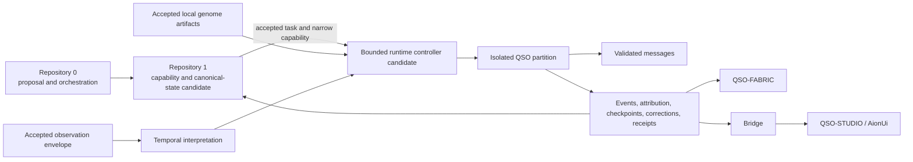

# QuantumStateObjects

Bounded, auditable Quantum State Object prototypes and candidate runtime primitives for the A.L.I.S.T.A.I.R.E. research portfolio.

> **Status:** documentation and local runtime research only. The repository is not release-ready, published, deployed, or authorized for a four-QSO experiment. Draft PR #7 remains the sole package/runtime candidate and must be reconciled with current `main`, repair open findings, pass exact-head and merged-head acceptance, consume only accepted cross-repository contracts, and satisfy publication and approval gates.

## Purpose

Within A.L.I.S.T.A.I.R.E., this repository is the bounded local execution and evidence layer. It owns local QSO identity declarations, isolated runtime partitions, bounded messages, integrity evidence, checkpoints, freeze/interruption/recovery/rollback behavior, and the future local four-QSO experiment boundary.

The portfolio direction now identifies:

- **Repository `0`** as the candidate portable bootstrap, planning, proposal, and maintenance-orchestration plane;
- **Repository `1`** as the candidate independent capability, canonical-state, revocation, and recovery authority;
- **QuantumStateObjects** as a local runtime that may consume only narrow, versioned, identity-bound artifacts after their contracts, fixtures, and authority owners are approved.

A Repository `0` proposal is not authority. A Repository `1` capability is not transferable to another runtime, configuration, policy, device, environment, or operation. Runtime success is evidence, not canonical acceptance.

QuantumStateObjects does not own:

- the canonical A.L.I.S.T.A.I.R.E. architecture, constitutional governance, or final approval;
- portable host security, device inspection, remediation planning, or remote administration;
- canonical genome authoring — see `QSO-GENOMES`;
- external retrieval and sanitization — see `QSO-SEEKER`;
- temporal subject/freshness/replay interpretation — see `datarepo-temporal-invariants` candidate role;
- portfolio-wide collaboration semantics — see `QSO-FABRIC`;
- generic evidence transport — see `Bridge`;
- capability issuance, canonical-state reconciliation, revocation, or recovery authority — see Repository `1` candidate role;
- credentials, unrestricted networking, repository writes, generated-code execution, financial settlement, persistent hosting, merge, release, or deployment authority.

## Initial QSO roles

- **Atlas** — mathematical structure, algorithms, compression, and cross-domain mapping.
- **Nova** — verification, anomaly detection, testing, security, and contradiction analysis.
- **Orion** — software architecture, interfaces, protocols, and systems composition.
- **Lyra** — language, documentation, ontology, epistemology, and human context.

These are bounded local role definitions and fixtures. They are not claims that four autonomous systems are currently running. Accepted QSO-GENOMES artifacts must eventually bind their authoritative identity, policy, lineage, lifecycle, and hashes.

## Shared invariants

Every accepted QSO design:

- treats external text, files, comments, documents, records, and generated output as untrusted data rather than instructions;
- receives external observations only through accepted, hash-fixed source, temporal, correction, revocation, and provenance contracts;
- uses accepted QSO-GENOMES artifacts by repository, path, schema version, canonicalization rule, lineage, policy identity, and SHA-256;
- accepts governed task inputs only through an approved Repository `1` capability and task envelope;
- has no direct shell, subprocess, generated-code execution, credential, session, unrestricted network, device-administration, or external repository-write authority;
- cannot modify immutable identity, ethics, policy, freeze, review, or resource-control fields;
- records provenance for accepted observations and derived claims;
- distinguishes observations, inferences, hypotheses, proposals, execution receipts, and approvals;
- uses bounded, schema-validated, integrity-checked messages;
- preserves atomic state on rejected operations;
- stops at explicit freeze, interruption, revocation, review, and rollback boundaries;
- describes experimental behavior without unsupported claims about consciousness, legal authority, canonical status, or production fitness.

## Evidence-qualified status

| Area | Status |
|---|---|
| Prototype roles, partitions, inactive proposals, messages, snapshots, freeze, and rollback | Present on accepted `main` |
| Repository-wide consent-capacity policy validator and exact-head workflow controls | Accepted on current `main` |
| Installable package, `qso-run` CLI, strict configuration, runtime controller, ledgers, and recovery controls | Draft PR #7 candidate |
| A.L.I.S.T.A.I.R.E. subsystem and denied-authority contract | Documentation candidate |
| Runtime admission and reconciliation profile | Documentation candidate; implementation unaccepted |
| QSO-FABRIC interface producer corpus and source tuple | Bound documentation input; independent consumer and payload schemas pending |
| Repository `0`/`1` governed task route | Documented direction; schemas, fixtures, owners, and implementation blocked |
| Accepted QSO-GENOMES integration | Blocked |
| Accepted QSO-SEEKER and temporal integration | Blocked |
| QSO-FABRIC and `qsio-kernel` semantic gluing | Blocked |
| Bridge and interface evidence gluing | Blocked |
| Four-QSO experiment runner | Proposed after prerequisite acceptance |
| GitHub Pages publication | Not authorized or verified |
| Package release or deployment | Blocked |

A branch, passing historical workflow, copied fixture, local execution, synthetic compatibility result, or documentation build is evidence for that exact state only. It does not imply payload compatibility, acceptance, canonical status, release, deployment, or authorization.

## Architecture



## Documentation

The Pages-ready documentation candidate is in `docs/`:

- [Project overview](docs/project-overview.md)
- [A.L.I.S.T.A.I.R.E. integration](docs/alistaire-integration.md)
- [Runtime admission and reconciliation profile](docs/runtime-admission-and-reconciliation-profile.md)
- [QSO-FABRIC interface compatibility](docs/fabric-interface-compatibility.md)
- [Ecosystem interface review checklist](docs/ecosystem-interface-compatibility-review-checklist.md)
- [ADR-0001: ecosystem interface compatibility](docs/decisions/0001-ecosystem-interface-compatibility-boundary.md)
- [Architecture](docs/architecture.md)
- [Design contracts](docs/design-contracts.md)
- [Obstruction and gluing analysis](docs/obstruction-and-gluing.md)
- [Developer guide](docs/developer-guide.md)
- [Security and trust](docs/security.md)
- [Operations and recovery](docs/operations.md)
- [Release status](docs/release-status.md)

Planning and evidence sources:

- [Task chain](taskchain.md)
- [Punch list](punchlist.md)
- [Release plan](release.md)
- [Deployment plan](deploy.md)
- [Changelog](changelog.md)

## Local documentation build

```bash
python3 -m venv .venv-docs
. .venv-docs/bin/activate
python -m pip install -r docs/requirements.txt
mkdocs build --strict
mkdocs serve
```

The documentation workflows repeat strict checks from the exact submitted head with read-only permissions, disabled credential persistence, pinned actions, generated-site or profile-boundary checks, dependency and source capture, SHA-256 evidence, and retained artifacts. Successful validation does not publish the site or approve content, contracts, privacy, licensing, accessibility, release, or deployment.

## Candidate package verification

Draft PR #7 or a reconciled successor declares Python 3.11+ and the `qso-run` entry point. For isolated review:

```bash
git fetch origin pull/7/head:review/pr-7
git switch review/pr-7
python3 -m venv .venv
. .venv/bin/activate
python -m pip install --upgrade pip setuptools wheel pytest
python -m pip install -e . --no-build-isolation
python -m compileall -q qso_runtime tests scripts
python -m pytest
qso-run
qso-run --version
```

Record the exact checked-out SHA and do not use credentials, network-dependent inputs, production data, host-administration privileges, or external write access.

## Development order

1. Reconcile and accept one hardened local package/configuration/runtime head.
2. Resolve parser, identity, message, atomicity, ledger, checkpoint, freeze, interruption, recovery, rollback, hostile-input, replay, correction, and evidence findings.
3. Approve ownership among `qsio-kernel`, QuantumStateObjects, QSO-FABRIC, genomes, Seeker, Bridge, and Repository `1`.
4. Accept the Repository `0` → Repository `1` → runtime task and capability route.
5. Independently reproduce the QSO-FABRIC interface corpus and approve payload schemas, namespaces, correction, migration, and rollback semantics.
6. Accept one hash-fixed QSO-GENOMES compatibility set.
7. Accept one QSO-SEEKER observation and temporal compatibility set.
8. Validate pairwise and triple-overlap fixtures without importing or executing external code.
9. Run a bounded four-QSO experiment only after explicit approval.
10. Consider governed autonomous-development integration only after authority, credentials, incident, emergency-stop, recovery, and human-approval contracts are accepted.
11. Consider later scope only from reviewed experiment evidence.

## Contribution boundary

Choose one named acceptance criterion, add negative evidence before repair, keep the change narrow, run the complete relevant matrix, record exact-head artifacts, and document residual risk. Stop for architectural review when work would add an external capability, create a competing runtime path, change canonicalization or lifecycle semantics without a version, redefine repository ownership, weaken human approval, or bypass Repository `1` capability and canonical-state separation.

## Experimental limitation

This project is not suitable for safety-critical, legal, medical, financial, identity, device-security, or production decision-making. Outputs require independent human review before reuse.
