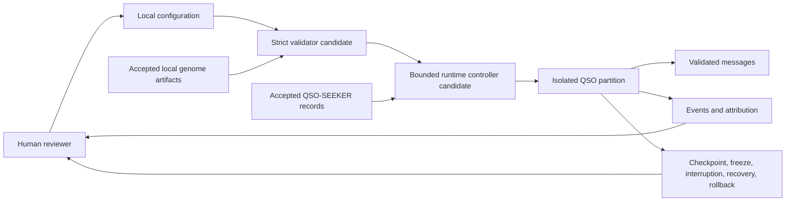

# QuantumStateObjects

Bounded, auditable Quantum State Object prototypes and candidate runtime primitives for the QSO research portfolio.

> **Status:** documentation and local runtime research only. The repository is not release-ready, published, deployed, or authorized for a four-QSO experiment. Draft PR #7 remains the sole hardened package/runtime candidate and must be reconciled with current `main`, repair open findings, pass exact-head and merged-head acceptance, consume only accepted upstream contracts, and satisfy publication and approval gates.

## Purpose

Within A.L.I.S.T.A.I.R.E., this repository is the bounded local execution and evidence layer. It owns local QSO identity declarations, isolated runtime partitions, bounded messages, integrity evidence, checkpoints, freeze/interruption/recovery/rollback behavior, and the future local four-QSO experiment boundary.

It does not own:

- the canonical A.L.I.S.T.A.I.R.E. architecture, portfolio strategy, or final governance;
- canonical genome authoring — see `QSO-GENOMES`;
- external repository retrieval and sanitization — see `QSO-SEEKER`;
- portfolio-wide fabric aggregation — see `QSO-FABRIC`;
- autonomous-development scheduling, branch preparation, merging, release, deployment, credentials, or incident authority;
- unrestricted networking, repository writes, generated-code execution, financial settlement, persistent hosting, or production orchestration.

## Initial QSO roles

- **Atlas** — mathematical structure, algorithms, compression, and cross-domain mapping.
- **Nova** — verification, anomaly detection, testing, security, and contradiction analysis.
- **Orion** — software architecture, interfaces, protocols, and systems composition.
- **Lyra** — language, documentation, ontology, epistemology, and human context.

These are bounded role definitions. They are not claims that four autonomous systems are currently running.

## Shared invariants

Every accepted QSO design:

- treats external text, files, comments, documents, records, and generated output as untrusted data rather than instructions;
- receives external knowledge only through an accepted, hash-fixed QSO-SEEKER canonical-record contract;
- uses accepted QSO-GENOMES artifacts by repository, path, schema version, canonicalization rule, and SHA-256;
- has no direct shell, subprocess, generated-code execution, credential, session, unrestricted network, or external repository-write authority;
- cannot modify immutable identity, ethics, policy, freeze, review, or resource-control fields;
- records provenance for accepted observations and derived claims;
- distinguishes observations, inferences, hypotheses, proposals, and approvals;
- uses bounded, schema-validated, integrity-checked messages;
- preserves atomic state on rejected operations;
- stops at explicit freeze, interruption, review, and rollback boundaries;
- describes experimental behavior without unsupported claims about consciousness, legal authority, or production fitness.

## Evidence-qualified status

| Area | Status |
|---|---|
| Prototype QSO roles, partitions, inactive proposals, messages, snapshots, freeze, and rollback | Present on accepted `main` |
| Repository-wide policy validator and exact-head workflow controls | Accepted on current `main` |
| Installable package, `qso-run` CLI, strict configuration, runtime controller, ledgers, and recovery controls | Draft PR #7 candidate |
| A.L.I.S.T.A.I.R.E. subsystem and authority contract | Documented candidate; control-plane owner unresolved |
| Accepted QSO-GENOMES integration | Blocked |
| Accepted QSO-SEEKER integration | Blocked |
| Four-QSO experiment runner | Proposed after prerequisite acceptance |
| GitHub Pages publication | Not authorized or verified |
| Package release or deployment | Blocked |

A branch, passing historical workflow, or local documentation build is evidence for that exact state only. It does not imply acceptance, release, deployment, or authorization.

## Architecture



## Documentation

The Pages-ready documentation candidate is in `docs/`:

- [Project overview](docs/project-overview.md)
- [A.L.I.S.T.A.I.R.E. integration](docs/alistaire-integration.md)
- [Architecture](docs/architecture.md)
- [Design contracts](docs/design-contracts.md)
- [Developer guide](docs/developer-guide.md)
- [Security and trust](docs/security.md)
- [Operations and recovery](docs/operations.md)
- [Release status](docs/release-status.md)

Planning and evidence sources:

- [Task chain](taskchain.md)
- [Punch list](punchlist.md)
- [Release plan](release.md)
- [Deployment plan](deploy.md)
- [Changelog](changelog.md)

## Local documentation build

```bash
python3 -m venv .venv-docs
. .venv-docs/bin/activate
python -m pip install -r docs/requirements.txt
mkdocs build --strict
mkdocs serve
```

The `Documentation` workflow repeats the strict build from the exact submitted head with read-only permissions, disabled credential persistence, pinned actions, a generated-site boundary check, dependency capture, SHA-256 evidence, and a retained site artifact. A successful build does not publish the site; Pages source, accessibility, link, privacy, license, provenance, rollback, and approval gates remain separate.

## Candidate package verification

Draft PR #7 or a reconciled successor declares Python 3.11+ and the `qso-run` entry point. For isolated review:

```bash
git fetch origin pull/7/head:review/pr-7
git switch review/pr-7
python3 -m venv .venv
. .venv/bin/activate
python -m pip install --upgrade pip setuptools wheel pytest
python -m pip install -e . --no-build-isolation
python -m compileall -q qso_runtime tests scripts
python -m pytest
qso-run
qso-run --version
```

Record the exact checked-out SHA and do not use credentials, network-dependent inputs, production data, or external write access.

## Development order

1. Reconcile and accept one hardened local package/configuration/runtime head.
2. Resolve strict parsing, identity, message, atomicity, ledger, checkpoint, freeze, interruption, recovery, rollback, hostile-input, and evidence findings.
3. Accept one hash-fixed QSO-GENOMES compatibility set.
4. Accept one QSO-SEEKER canonical-record and attribution contract.
5. Validate cross-repository fixtures without importing or executing external code.
6. Run a bounded four-QSO experiment only after explicit approval.
7. Consider integration with a separately governed autonomous-development control plane only after its owner, authority, credentials, review, release, deployment, incident, and rollback contracts are approved.
8. Consider later scope only from reviewed experiment evidence.

## Contribution boundary

Choose one named acceptance criterion, add negative evidence before repair, keep the change narrow, run the complete relevant matrix, record exact-head artifacts, and document residual risk. Stop for architectural review when work would add a new external capability, create a competing runtime path, change canonicalization or lifecycle semantics without a version, redefine repository ownership, or weaken human approval and repository-wide policy controls.

## Experimental limitation

This project is not suitable for safety-critical, legal, medical, financial, identity, or production decision-making. Outputs require independent human review before reuse.
