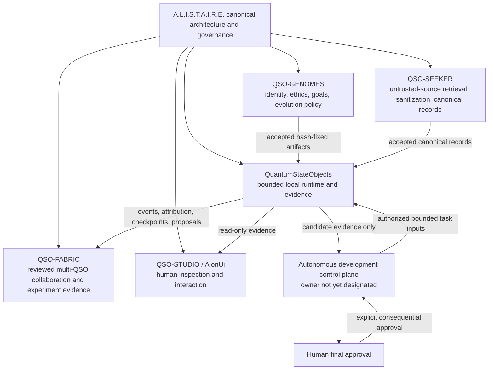
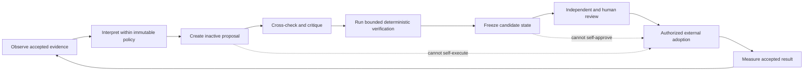
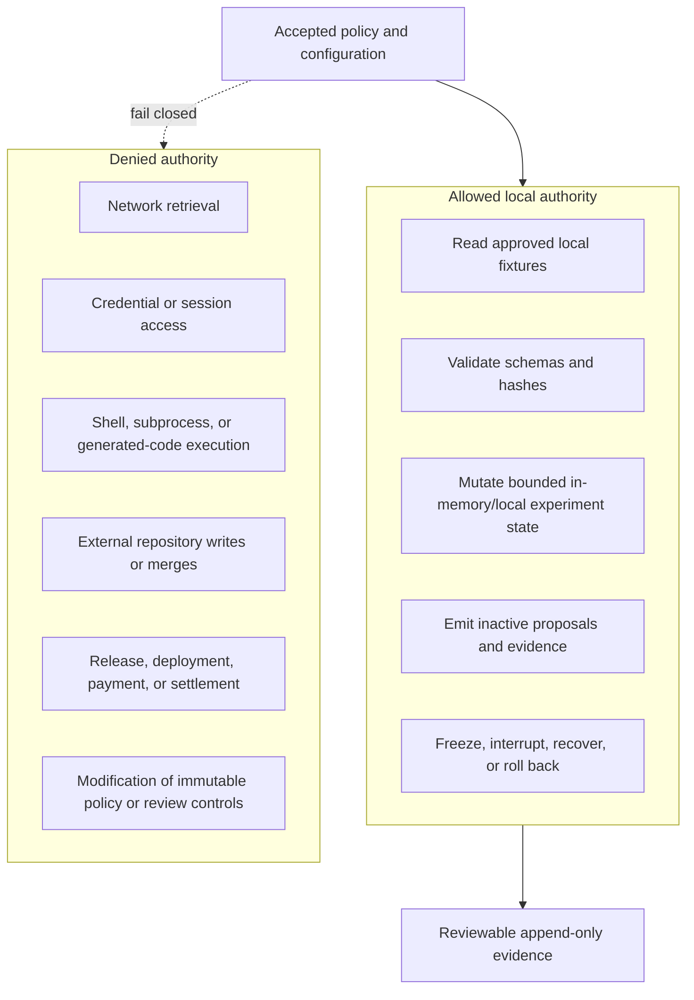

# A.L.I.S.T.A.I.R.E. integration

QuantumStateObjects is the bounded local execution and evidence layer for the wider A.L.I.S.T.A.I.R.E. system. It turns accepted declarative identities, genomes, configuration, and canonical records into constrained runtime state and reviewable evidence.

This page defines the intended portfolio relationship. It does not authorize a four-QSO experiment, autonomous repository mutation, package publication, persistent execution, or deployment.

## System position

A.L.I.S.T.A.I.R.E. is the canonical system root. Portfolio repositories contribute one explicit responsibility rather than developing as independent products.

## Repository responsibility

QuantumStateObjects owns the semantics and verification of:

- local QSO instantiation from accepted identity and genome references;
- isolated state partitions and bounded resource use;
- schema-validated, integrity-checked messages;
- canonical record ingestion with atomic failure behavior;
- inactive proposals that cannot execute themselves;
- append-only event and attribution evidence;
- deterministic state and evidence hashes;
- checkpoints, freeze, interruption, recovery, and rollback;
- local compatibility validation for accepted QSO-GENOMES and QSO-SEEKER artifacts.

It does **not** own:

- A.L.I.S.T.A.I.R.E. portfolio strategy or final architecture approval;
- genome authorship or immutable ethics policy;
- external retrieval, scraping, source authorization, or sanitization;
- portfolio-wide scheduling, branch creation, pull-request preparation, merging, release, or deployment;
- credentials, secret distribution, payment authority, or production infrastructure;
- unrestricted self-modification, background operation, or distributed execution.

## Autonomous development relationship

The long-term portfolio goal is increasingly capable autonomous development. QuantumStateObjects contributes a bounded cognition-and-evidence primitive to that goal; it is not itself the autonomous-development control plane.

Within this loop, the repository may eventually produce structured proposals, critiques, tests, and evidence. Adoption remains an external authorized action. A proposal is data, not authority.

## Contract boundaries

| Boundary | Producer | QuantumStateObjects obligation | Failure behavior |
|---|---|---|---|
| System policy | A.L.I.S.T.A.I.R.E. canonical root | Bind to an approved policy/version identity | Reject unknown or incompatible policy |
| Genome artifact | QSO-GENOMES | Verify repository, path, schema, canonicalization, and SHA-256 | Reject before instantiation |
| Canonical record | QSO-SEEKER | Verify record schema, content hash, flags, transformations, and provenance | Reject before state mutation |
| Task input | Future control plane | Accept only a bounded, versioned, authorized task envelope | Reject unauthorized authority or capability |
| Runtime evidence | QuantumStateObjects | Emit canonical events, attribution, checkpoints, and result hashes | Stop/freeze on evidence failure |
| Collaboration evidence | QSO-FABRIC | Export only validated, inactive records and proposals | Preserve local state on rejection |
| Human interface | QSO-STUDIO or AionUi | Expose read-only evidence and explicit review requests | Never infer approval from display or access |

No cross-repository integration is accepted merely because a path, branch, or pull request exists. Every consumed artifact must be bound to an approved immutable identity and verified locally without importing or executing its code.

## Authority model

These denials are architectural invariants, not optional deployment settings. Adding one requires an explicit portfolio-level architecture decision, a separately reviewed service boundary, threat modeling, versioned contracts, tests, rollback, and approval.

## Capability progression

Progress is evidence-gated rather than claim-gated.

| Level | Capability | Repository status |
|---|---|---|
| Q0 | Declarative roles and bounded prototype behavior | Present on accepted `main` |
| Q1 | Hardened installable package, CLI, configuration, runtime controller, and evidence | Candidate in draft PR #7 |
| Q2 | Accepted hash-fixed genome and canonical-record compatibility | Blocked on upstream acceptance and Q1 |
| Q3 | Bounded deterministic four-QSO experiment | Proposed after Q2 and explicit approval |
| Q4 | Repeated experiments with reviewed improvement proposals | Future scope based on accepted Q3 evidence |
| Q5 | Integration with a separately governed autonomous-development control plane | Architectural owner and authority contract unresolved |

Higher levels do not inherit approval from lower ones. Every transition requires immutable source identity, complete verification, retained evidence, review disposition, rollback, and explicit authorization.

## Required control-plane clarification

Before Q5 design can become implementation scope, the portfolio must designate which repository or service owns:

- task prioritization and dependency resolution;
- authorization and capability grants;
- branch and pull-request preparation;
- independent verification and evidence retention;
- merge, release, deployment, and rollback decisions;
- credentials and secret isolation;
- incident response and emergency stop authority;
- cross-repository schema and migration coordination;
- human final approval for consequential actions.

Until that decision is recorded, QuantumStateObjects must remain a local, credential-free, non-deploying runtime and evidence boundary.

## Documentation alignment rule

Changes to this page must be reconciled with:

- the canonical A.L.I.S.T.A.I.R.E. architecture and repository ledger;
- `README.md`, `taskchain.md`, `release.md`, `deploy.md`, and `changelog.md`;
- current accepted `main` behavior;
- the exact state of draft PR #7 and its review findings;
- accepted QSO-GENOMES, QSO-SEEKER, QSO-FABRIC, QSO-STUDIO, and interface contracts.

When portfolio intent and accepted implementation differ, documentation must state both explicitly and must not present planned capability as implemented, accepted, released, or deployed.
