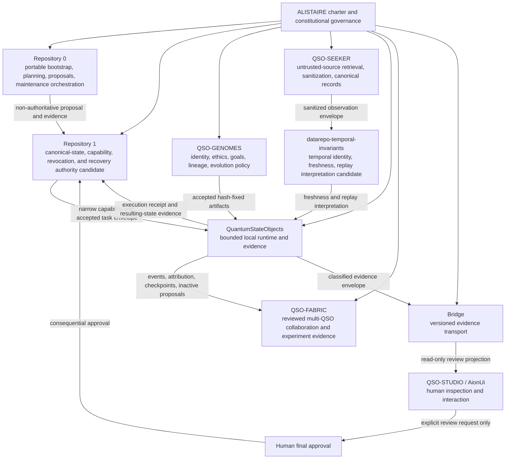
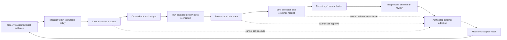
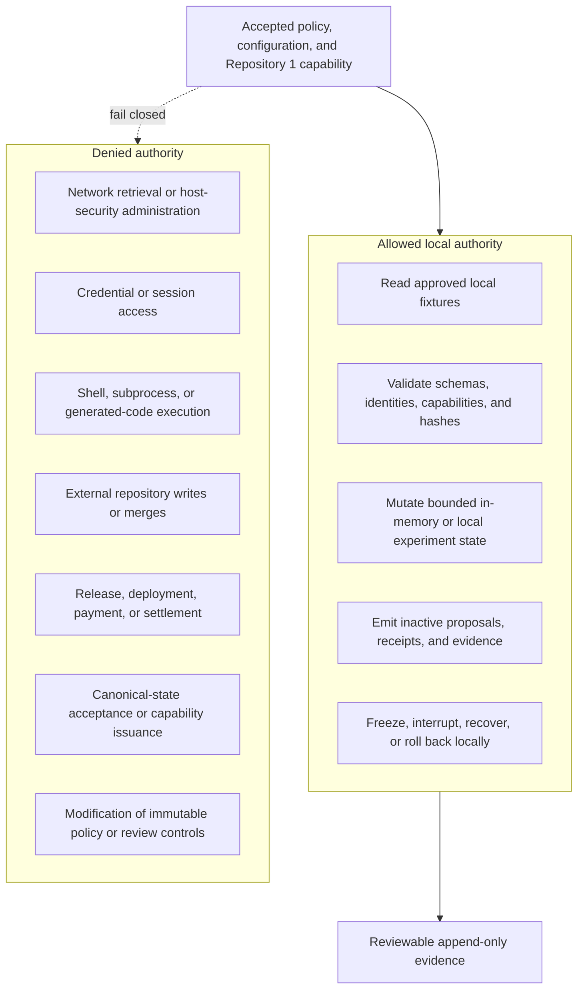

# A.L.I.S.T.A.I.R.E. integration

QuantumStateObjects is the bounded local execution and evidence layer for the wider A.L.I.S.T.A.I.R.E. system. It turns accepted declarative identities, genomes, policy, configuration, capabilities, and canonical records into constrained runtime state and reviewable evidence.

This page defines the intended portfolio relationship. It does not authorize a four-QSO experiment, autonomous repository mutation, package publication, persistent execution, device administration, or deployment.

## System position

A.L.I.S.T.A.I.R.E. is the canonical system root. Portfolio repositories contribute one explicit responsibility rather than developing as independent products.

## Repository responsibility

QuantumStateObjects owns the semantics and verification of:

- local QSO instantiation from accepted identity, genome, policy, configuration, and capability references;
- isolated runtime state partitions and bounded resource use;
- schema-validated, integrity-checked messages;
- canonical record ingestion with atomic failure behavior;
- inactive proposals that cannot execute themselves;
- append-only event and attribution evidence;
- deterministic state and evidence hashes;
- checkpoints, freeze, interruption, recovery, and rollback;
- local compatibility validation for accepted upstream artifacts and task envelopes.

It does **not** own:

- A.L.I.S.T.A.I.R.E. constitutional governance or final architecture approval;
- Repository `0` host bootstrap, device inspection, portfolio planning, branch preparation, or maintenance orchestration;
- Repository `1` capability issuance, canonical-state reconciliation, revocation, emergency-stop recovery, or approval authority;
- genome authorship or immutable ethics policy;
- external retrieval, scraping, source authorization, sanitization, or temporal interpretation;
- portfolio-wide collaboration semantics, generic evidence transport, publication, credentials, payment, merge, release, or deployment authority;
- unrestricted self-modification, background operation, or distributed execution.

## Portable security relationship

Repositories `0` and `1` are intended to be the portable first-install security and recovery foundation for a new, recovered, replaced, reset, or suspect owned device. QuantumStateObjects is not the host-security collector or device-management authority. It may later run bounded local QSO workloads only after:

1. Repository `0` has produced a read-only device/environment inventory and non-authoritative proposal;
2. Repository `1` has validated identity, baseline, policy, freshness, replay, expected head, and human-approval requirements;
3. Repository `1` has issued a narrow, expiring, revocable capability and accepted task envelope;
4. the runtime has verified that envelope against its exact package, configuration, policy, device, and environment identities.

A Repository `0` proposal is data, not authority. A Repository `1` capability is not transferable to another device, environment, runtime head, policy, or operation. Runtime success is evidence, not canonical acceptance.

## Autonomous development relationship

The portfolio goal is increasingly capable autonomous development under explicit security, evidence, and human-governance constraints. Repository `0` is the candidate planning and engineering-orchestration plane. Repository `1` is the candidate independent canonical-state and capability authority. QuantumStateObjects contributes a bounded cognition-and-evidence primitive; it does not plan portfolio work or approve its own expanded authority.

Within this loop, the repository may eventually produce structured proposals, critiques, tests, and evidence. Adoption remains an external authorized action.

## Contract boundaries

| Boundary | Producer | QuantumStateObjects obligation | Failure behavior |
|---|---|---|---|
| Constitutional policy | `ALISTAIRE-` and accepted governance records | Bind to an approved policy/version identity | Reject unknown or incompatible policy |
| Bootstrap proposal | Repository `0` | Treat as non-authoritative evidence only | Never infer capability or approval |
| Capability and task | Repository `1` | Verify requester, issuer, scope, device/environment, runtime/configuration head, expiry, replay, policy, and expected state | Do not start or mutate runtime |
| Genome artifact | QSO-GENOMES | Verify repository, path, schema, canonicalization, lineage, policy, and SHA-256 | Reject before instantiation |
| Canonical observation | QSO-SEEKER plus approved temporal owner | Verify subject, source, provenance, content hash, clocks, freshness, replay, correction, revocation, classification, and uncertainty | Reject before state mutation |
| Runtime evidence | QuantumStateObjects | Emit canonical events, attribution, checkpoints, result hashes, corrections, and execution receipts | Stop or freeze on evidence failure |
| Collaboration evidence | QSO-FABRIC | Export only validated, inactive records and proposals | Preserve local state on rejection |
| Evidence transport | Bridge | Emit a classified, integrity-bound, versioned envelope | Keep evidence local if destination or policy fails |
| Human interface | QSO-STUDIO or AionUi | Expose read-only evidence and explicit review requests | Never infer approval from display or access |
| Canonical reconciliation | Repository `1` | Submit execution receipts and resulting-state evidence | Local success remains non-canonical on rejection |

No cross-repository integration is accepted merely because a path, branch, pull request, artifact, or passing historical workflow exists. Every consumed artifact must be bound to an approved immutable identity and verified locally without importing or executing producer code.

## Authority model

These denials are architectural invariants, not optional deployment settings. Adding one requires a portfolio-level architecture decision, separately reviewed service boundary, threat model, versioned contracts, tests, rollback, and explicit approval.

## Capability progression

Progress is evidence-gated rather than claim-gated.

| Level | Capability | Repository status |
|---|---|---|
| Q0 | Declarative roles and bounded prototype behavior | Present on accepted `main` |
| Q1 | Hardened installable package, CLI, configuration, runtime controller, and evidence | Candidate in draft PR #7 |
| Q2 | Accepted genome, observation, capability, and task-envelope compatibility | Blocked on upstream acceptance and Q1 |
| Q3 | Bounded deterministic four-QSO experiment | Proposed after Q2 and explicit approval |
| Q4 | Repeated experiments with reviewed improvement proposals | Future scope based on accepted Q3 evidence |
| Q5 | Repository `0` / Repository `1` governed autonomous-development integration | Architecture direction identified; contracts, fixtures, authority owners, and implementation remain unaccepted |

Higher levels do not inherit approval from lower ones. Every transition requires immutable source identity, complete verification, retained evidence, review disposition, rollback, and explicit authorization.

## Required architectural decisions

Before Q2–Q5 integration can become implementation scope, the portfolio must approve:

- canonical ownership for QSO format, canonicalization, lifecycle, messages, events, ledgers, checkpoints, freeze, rollback, and migrations;
- the exact Repository `0` → Repository `1` → runtime task/capability route;
- genome, observation, temporal, evidence, correction, revocation, resource, clock, replay, and reason-code schemas;
- the responsibility split among `qsio-kernel`, QuantumStateObjects, QSO-FABRIC, Bridge, interfaces, and Repository `1`;
- privacy, retention, key custody, incident, emergency-stop, recovery, release, and rollback ownership;
- identical pairwise and triple-overlap compatibility fixtures at immutable commits.

Until those decisions are accepted, QuantumStateObjects remains a local, credential-free, non-deploying runtime and evidence boundary.

## Documentation alignment rule

Changes to this page must be reconciled with:

- the canonical A.L.I.S.T.A.I.R.E. architecture and governance charter;
- Repository `0` and Repository `1` portable security and capability contracts;
- `README.md`, `taskchain.md`, `punchlist.md`, `release.md`, `deploy.md`, and `changelog.md`;
- current accepted `main` behavior;
- the exact state of draft PR #7 and its review findings;
- accepted QSO-GENOMES, QSO-SEEKER, temporal, QSO-FABRIC, Bridge, QSO-STUDIO, AionUi, and `qsio-kernel` contracts;
- [the obstruction and gluing ledger](obstruction-and-gluing.md).

When portfolio intent and accepted implementation differ, documentation must state both explicitly and must not present planned capability as implemented, accepted, released, or deployed.
