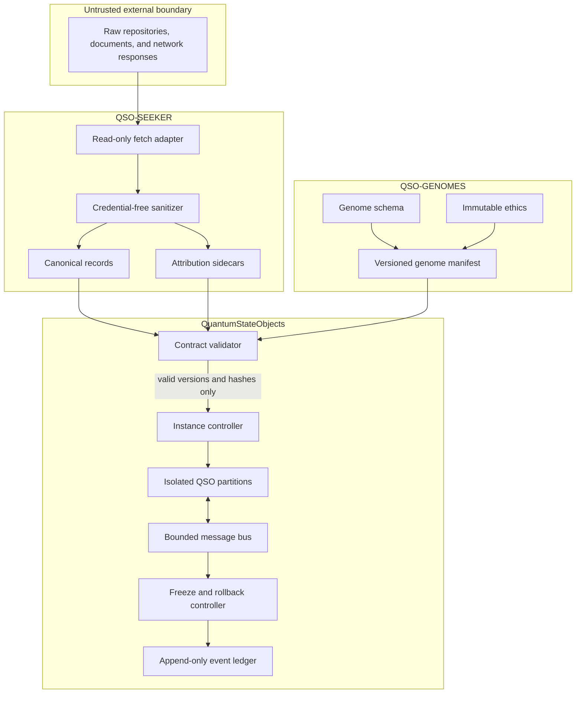
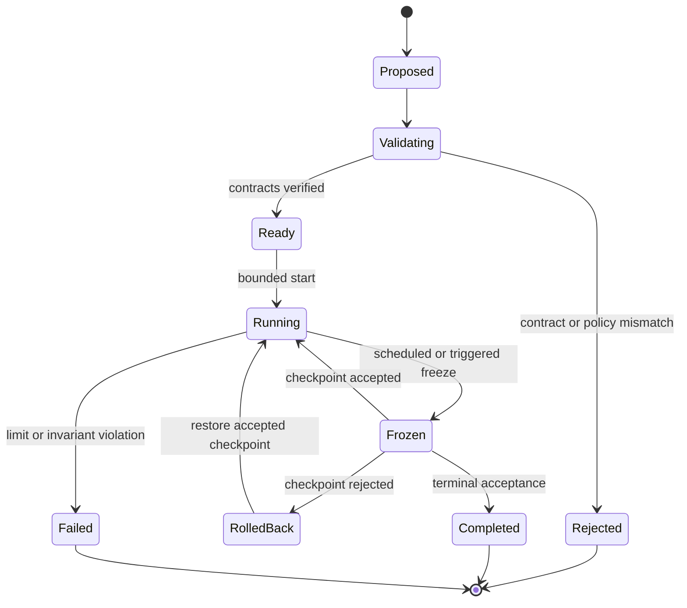

# Architecture

## Design objective

The runtime is designed to make every accepted input, state transition, inter-object message, freeze decision, and derived output attributable and reversible. The architecture favors explicit contracts and deterministic evidence over autonomy, hidden state, or implicit capability.

## Trust boundaries

Raw external material never enters a QSO partition. `QSO-SEEKER` first converts it into bounded canonical records and attribution sidecars. `QSO-GENOMES` publishes declarative configuration and immutable constraints. The runtime validates both contract families by schema version and canonical hash before constructing an instance.

## Runtime components

### Contract validator

The validator is the only entry point for external portfolio contracts. It must:

- validate schemas locally without importing or executing upstream repository code;
- verify canonical hashes before parsing data into runtime state;
- enforce supported-version allowlists;
- reject unknown fields where schemas require closed objects;
- fail closed and emit an evidence record on every mismatch.

### Instance controller

The instance controller creates a bounded partition for each approved QSO. It owns lifecycle state, resource limits, deterministic seed assignment, freeze scheduling, and references to immutable configuration. A QSO cannot modify the controller, its identity key, immutable ethics, or its resource envelope.

### QSO partitions

Atlas, Nova, Orion, and Lyra operate in separate logical partitions. Each partition receives only:

- its validated genome view;
- bounded canonical observations;
- messages accepted by the message schema;
- the minimum state required for its declared role.

No partition receives direct shell, subprocess, package-installation, credential, or unrestricted network authority.

### Message bus

Messages are inert structured records. Validation occurs before delivery and includes:

- sender and recipient identity;
- schema and protocol version;
- correlation and causal references;
- bounded payload size;
- observation/inference/hypothesis classification;
- provenance references and content hashes;
- expiry or experiment-step limit.

Invalid messages are rejected and recorded rather than repaired silently.

### Freeze and rollback controller

Freeze points create deterministic review boundaries. At a freeze point the controller:

1. stops state mutation;
2. serializes bounded state and pending proposals;
3. records event, message, and attribution hashes;
4. evaluates acceptance rules;
5. either commits the checkpoint or restores the last accepted checkpoint.

Rollback never deletes failed evidence. The rejected transition and its reason remain append-only artifacts.

### Event and attribution ledger

The ledger records facts about the experiment rather than subjective claims about intelligence or consciousness. Minimum event fields should include experiment ID, step, timestamp or logical clock, object ID, event type, contract hashes, input/output hashes, seed, resource counters, freeze decision, and causal references.

## State model

## Cross-repository compatibility contract

The runtime should consume two machine-readable manifests:

| Manifest | Publisher | Minimum contents |
|---|---|---|
| Genome compatibility manifest | `QSO-GENOMES` | schema version, genome paths, immutable-ethics reference, Sprite reference, canonical hashes, compatibility status |
| Canonical-record contract | `QSO-SEEKER` | schema version, accepted/rejected fixtures, size limits, transformation rules, attribution fields, content hashes |

Compatibility must be established using data fixtures and hashes, not shared imports. This keeps repository boundaries testable and prevents an upstream repository from gaining executable authority inside the runtime.

## Security and privacy principles

- Treat all external text as hostile and non-authoritative.
- Use deny-by-default capability policies.
- Keep credentials outside runtime partitions.
- Record transformations and rejection reasons.
- Avoid personal identifiers in public fixtures and examples.
- Separate simulation records from real financial authorization or settlement.
- Preserve licensing and source attribution with every accepted record.

## Verification evidence

A completed architecture increment must attach:

- exact test and static-check commands;
- workflow run or local reproducer details;
- schema and fixture hashes;
- deterministic seeds and resource settings;
- freeze and rollback evidence;
- artifact checksums;
- residual risks and rollback instructions.

Until that evidence exists, diagrams and descriptions are architectural contracts, not claims that the runtime behavior has been implemented or verified.
