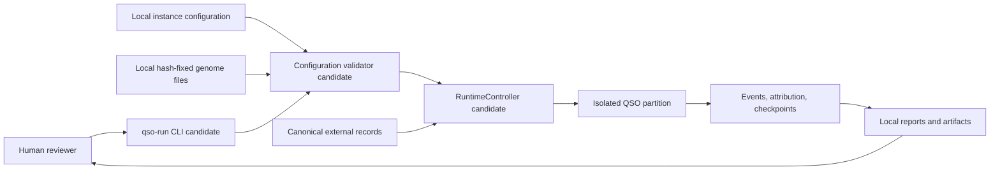
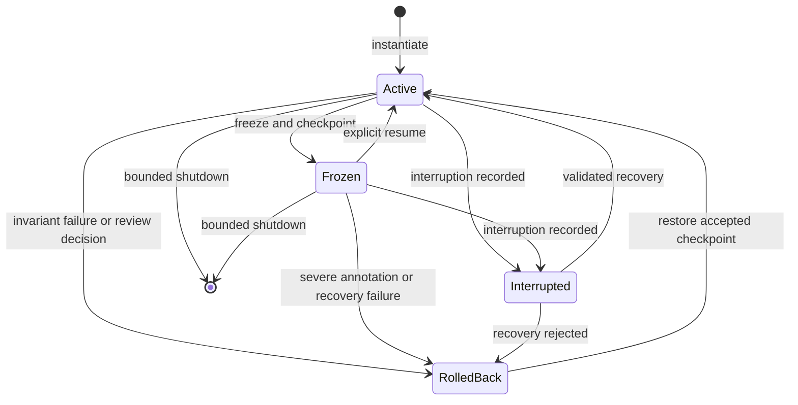
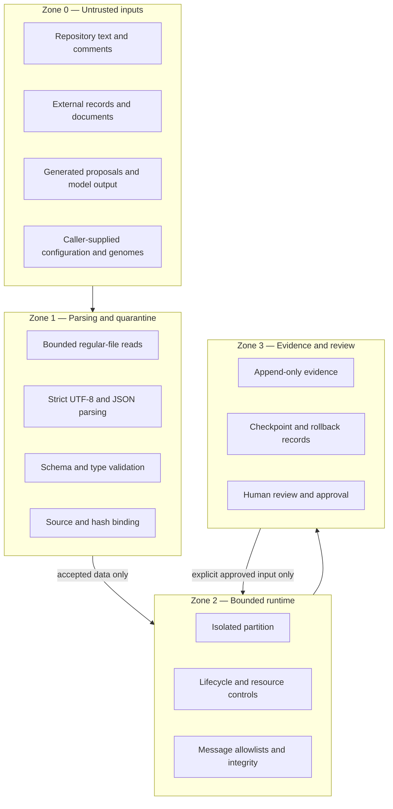
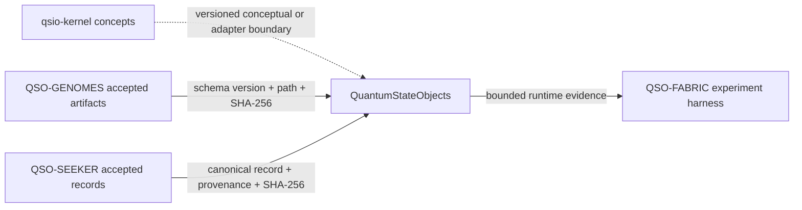

# Architecture

## Architectural stance

QuantumStateObjects is a local, deterministic, evidence-oriented runtime research project. The architecture uses narrow components and explicit trust boundaries so that configuration, external records, state changes, messages, and recovery actions can be reviewed independently.

The accepted `main` branch and draft PR #7 are deliberately distinguished throughout this document. Components described as **candidate** are not release-authorized.

## System context



The intended first environment is a disposable local checkout or CI job. No persistent service is part of the first release scope.

## Component model

### CLI boundary — candidate PR #7

The `qso-run` command provides machine-readable local verification:

- package/version reporting;
- a deterministic self-check describing denied external capabilities;
- optional local configuration validation;
- optional resolution of genome files beneath a caller-supplied local root;
- structured error output and non-zero exit status on invalid configuration.

The CLI is not an experiment scheduler, network client, repository agent, or deployment command.

### Configuration boundary — candidate PR #7

The configuration module is responsible for accepting or rejecting local instance declarations before runtime construction. Its candidate controls include:

- bounded regular-file reads;
- strict UTF-8 decoding;
- duplicate-key rejection;
- rejection of non-standard and non-finite JSON values;
- exact required and allowed keys;
- integer-only schema versions;
- canonical instance IDs, names, paths, versions, and hashes;
- an exact four-name set: Atlas, Nova, Orion, and Lyra;
- fixed QSO-GENOMES repository/path expectations;
- optional local hash resolution without network access.

Open review findings mean the parser contract must still be treated as candidate behavior.

### Genome interpreter — present in the prototype

`GenomeInterpreter` checks the minimum genome and identity envelope before constructing a QSO partition. It verifies required fields, a required forbidden-capability set, the QSO-SEEKER-only learning input boundary, and identity/genome name consistency.

The interpreter does not retrieve genomes. It consumes caller-supplied local data only after upstream validation.

### Partition and QSO object — present in the prototype

A partition contains:

- identity data;
- genome data;
- accepted records;
- inbox and outbox messages;
- inactive proposals;
- event evidence.

The QSO object performs bounded ingest, proposal construction, critique, message send/receive, snapshot, freeze, rollback, and event recording. Candidate PR #7 wraps these operations with stricter lifecycle, atomicity, resource, and evidence controls.

### Runtime controller — candidate PR #7

The candidate `RuntimeController` provides one isolated lifecycle wrapper around one QSO partition. Its intended responsibilities are:

- validate genome and identity construction inputs;
- enforce lifecycle states;
- pre-check resource limits;
- validate canonical records and messages;
- preserve atomic state on failure;
- capture canonical checkpoints;
- maintain hash-linked events and attribution evidence;
- freeze, resume, interrupt, recover, and roll back;
- expose deterministic state and ledger hashes.

It does not own distributed routing, model execution, remote storage, or cross-repository mutation.

### Evidence components — candidate PR #7

Evidence is split by purpose:

- **event ledger:** ordered runtime transitions and operation outcomes;
- **attribution journey:** source and derivation lineage for accepted observations or claims;
- **checkpoint:** canonical mutable state plus state and ledger digests;
- **freeze record:** review-oriented evidence tied to one canonical checkpoint;
- **CI evidence:** immutable head, commands, test results, artifacts, and hashes.

These evidence types must not be collapsed into one ambiguous log.

## Runtime sequence

```mermaid
sequenceDiagram
    actor Reviewer
    participant CLI
    participant Config as Config validator
    participant Runtime as Runtime controller
    participant QSO as QSO partition
    participant Ledger as Evidence ledgers

    Reviewer->>CLI: qso-run --config local.json --genome-root local/
    CLI->>Config: Read bounded local files
    Config->>Config: Strict decode, schema, path, and hash checks
    alt configuration rejected
        Config-->>CLI: Structured configuration error
        CLI-->>Reviewer: Exit 2; no runtime constructed
    else configuration accepted
        Config-->>CLI: Immutable runtime configuration
        CLI-->>Reviewer: Verification report
    end

    Reviewer->>Runtime: Construct from accepted local inputs
    Runtime->>QSO: Instantiate isolated partition
    QSO->>Ledger: Append instantiation evidence
    Reviewer->>Runtime: Submit canonical record or message
    Runtime->>Runtime: Validate type, authority, limits, and integrity
    alt operation rejected
        Runtime->>Runtime: Restore unchanged pre-operation state
        Runtime-->>Reviewer: Fail-closed error
    else operation accepted
        Runtime->>QSO: Apply bounded mutation
        QSO->>Ledger: Append linked event and attribution evidence
        Runtime-->>Reviewer: New state and evidence hashes
    end
```

## State machine



The exact transition set and evidence fields remain versioned candidate contracts until PR #7 is accepted.

## Trust zones



No text in Zone 0 can grant itself tool, policy, execution, network, credential, write, approval, or release authority.

## Dependency architecture



A repository name or branch reference is not enough to establish trust. Consumers require an accepted version, immutable commit or artifact identity, schema version, canonicalization rule, digest, and fixture set.

## Failure boundaries

| Failure | Required behavior |
|---|---|
| Invalid encoding or JSON | Reject before object construction |
| Missing, extra, or wrong-type fields | Reject with structured error |
| Path escape, symlink, oversized file, or wrong file type | Reject without reading as accepted input |
| Hash mismatch | Reject and preserve evidence of mismatch |
| Unknown identity, peer, recipient, or message kind | Reject before queue or ledger mutation |
| Resource ceiling reached | Reject or perform invariant-safe rollback using reserved evidence capacity |
| Delegated mutation raises | Restore the complete pre-operation state |
| Ledger or checkpoint verification fails | Mark evidence invalid and stop further trust promotion |
| Interruption | Preserve current evidence, enter explicit interrupted state, and require validated recovery |
| Severe review annotation | Roll back to the last accepted canonical checkpoint |

## Concurrency and distribution

The first release architecture is single-process and local. Multi-process, remote, distributed, or concurrent mutation semantics are not defined. Any later concurrency design must specify ordering, conflict resolution, identity, replay, checkpoint ownership, failure atomicity, and evidence composition before implementation.

## Persistence

The current design emphasizes in-memory state and local test artifacts. Durable databases, remote object stores, queues, or long-running services are outside the first candidate. Persisted evidence formats must be strictly validated before they are used as trustworthy input.
