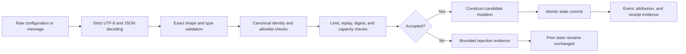

# Configuration and message boundaries

## Status and purpose

Status: `DOCUMENTED_NOT_IMPLEMENTED`

This guide defines the candidate contract between configuration parsing, runtime construction, message validation, state mutation, evidence generation, and recovery. It documents the remaining review findings on the current runtime candidate without changing runtime behavior, selecting a canonical schema, accepting PR #7, or authorizing execution.

Current observed runtime candidate:

- repository: `aevespers2/QuantumStateObjects`;
- pull request: `#7`;
- exact head: `cee0bad3baacde97c99251ae6be0f0e733a381a7`;
- state: open, draft, mergeable, and unmerged into `main`;
- evidence: CI run `30066794450` and Consent Capacity Lock run `30066794742` succeeded for that exact head.

Those runs establish evidence for their immutable source only. They do not resolve the remaining findings, accept the candidate, or authorize release.

## Boundary principle

A malformed, unknown, stale, unauthorized, replayed, over-capacity, or unverifiable input must be rejected **before** accepted runtime state changes. Error normalization must preserve the published exception boundary, and rejection evidence must not contain unnecessary source content, credentials, or sensitive values.

**Prose equivalent:** decode one bounded input strictly; validate its complete shape and exact types; resolve canonical identities and authorization; check limits, replay, digests, and capacity; reject without mutation when any requirement fails; otherwise prepare the complete state change, commit it atomically, and emit evidence bound to the accepted input and resulting state.

## Configuration contract

A future accepted configuration contract must define and version each of the following independently.

| Concern | Required rule | Rejection examples |
|---|---|---|
| Encoding | strict UTF-8 only | invalid bytes, UTF-16/32, lone surrogates |
| JSON | duplicate keys and non-finite numbers rejected | duplicate `repository`, `NaN`, `Infinity` |
| Root shape | exact object type and supported version | list root, string root, unknown version |
| Unknown fields | reject unless an extension namespace is explicitly versioned | misspelled or undeclared fields |
| Repository identity | one canonical owner/name representation | empty segments, aliases, URL-shaped value, non-string object |
| Object and role identity | canonical identifier grammar and declared role binding | unknown role, alias substitution, non-string identifier |
| Lifecycle fields | exact enum values and transition compatibility | arrays or objects used as enum values, unsupported state |
| Limits | materialized defaults, exact integer types, bounded ranges | missing delegated limit, Boolean-as-integer, zero, negative, overflow |
| Paths | relative, normalized, workspace-contained, non-aliased | absolute path, traversal, symlink escape, wrong type |
| Artifacts | bounded read, expected size, exact digest, immutable source tuple | oversize, changed file, missing path, permission error, digest mismatch |
| Policy | accepted identifier, version, digest, and immutable authority boundary | missing policy, stale policy, broadened capability |

Defaults are contract behavior. A default used by delegated ingest must either be materialized into the validated configuration before delegation or be explicitly forbidden. Hidden defaults must not broaden authority or bypass evidence.

## Message contract

A future accepted message contract must bind:

- message schema and version;
- canonical message identifier;
- sender and recipient identities;
- semantic message kind;
- immutable payload or payload digest;
- sequence, nonce, causal predecessor, and replay domain;
- creation, expiry, and accepted-clock references;
- size and resource accounting;
- capability, task, policy, and runtime-admission references;
- correction, supersession, contradiction, and revocation references where applicable.

### Validation order

1. Verify that the incoming value is an object before field access.
2. Reject unknown or missing fields according to the versioned schema.
3. Require exact string types for message kind, sender, recipient, identifiers, and digests.
4. Canonicalize and validate sender and recipient before hashing or allowlist membership checks.
5. Reject a singleton string where a collection of message kinds or recipients is required.
6. Verify semantic kind support, authorization, capability scope, and task binding.
7. Verify digest, ordering, nonce, expiry, replay window, and capacity.
8. Construct the complete candidate inbox, event, attribution, and resource update separately from accepted state.
9. Commit all related state atomically or commit nothing.
10. Emit bounded rejection or acceptance evidence without reproducing unnecessary payload content.

## Current exact-head findings

The current PR #7 head has already normalized structured enum and filesystem failures to the published `ConfigurationError` boundary. The remaining documented findings are:

| Finding | Required correction | Evidence needed |
|---|---|---|
| Canonical repository-field shape | accept only one exact string representation and reject aliases or structured values | positive and hostile fixtures plus unchanged-state proof |
| Singleton-string message allowlists | require the documented collection type rather than iterating characters | wrong-type fixture and deterministic reason code |
| `max_records` before delegated ingest | materialize or require the limit before any delegation | missing/default/zero/negative/overflow/Boolean fixtures |
| Message-kind type | reject non-string kinds before membership checks | list, object, number, Boolean, and null fixtures |
| Outgoing-recipient identity | canonicalize and validate before message hashing or mutation | invalid and alias recipient fixtures |
| Incoming-message shape | reject malformed values before field access or inbox mutation | scalar, list, partial object, unknown field, and atomicity fixtures |

Documentation of a finding is not its repair. Each finding remains open until the implementation, tests, exact-head workflow, review disposition, and resulting integrated state all agree.

## Failure and evidence model

Candidate failure classes:

- `DECODE_REJECTED` — input cannot be decoded under the accepted encoding contract;
- `SHAPE_REJECTED` — root or nested structure is invalid;
- `TYPE_REJECTED` — a field has the wrong exact type;
- `VERSION_UNSUPPORTED` — schema, policy, lifecycle, or message version is not accepted;
- `IDENTITY_REJECTED` — repository, object, sender, recipient, or role identity is invalid or unauthorized;
- `LIMIT_REJECTED` — a limit is missing, malformed, or outside the accepted range;
- `PATH_REJECTED` — a path violates normalization, containment, or source rules;
- `INTEGRITY_REJECTED` — digest, size, source, sequence, or predecessor evidence is invalid;
- `REPLAY_REJECTED` — nonce, sequence, expiry, or replay-window requirements fail;
- `CAPACITY_REJECTED` — accepted state lacks capacity for the complete atomic change;
- `AUTHORITY_REJECTED` — capability, task, policy, or runtime-admission scope does not permit the action;
- `INTERNAL_FAILURE` — a normalized local failure occurred before commit and prior state was preserved.

These names are documentation candidates, not implemented public API values. Final reason-code ownership, canonical bytes, localization, migration, and consumer semantics require separate approval.

Every rejection record should bind the exact runtime head, configuration and policy identities, input class, validation stage, reason class, state-before digest, state-after digest, and evidence digest. For a rejected operation, state-before and state-after must be identical.

## Atomicity and rollback

Configuration loading and message ingest must not partially update:

- configuration objects;
- identity registries;
- inboxes or outboxes;
- event and attribution ledgers;
- resource counters;
- checkpoints;
- freeze, interruption, recovery, or rollback state;
- execution receipts or downstream projections.

Rollback is not a substitute for pre-commit validation. When an operation can be validated completely before mutation, reject it before mutation. When a later failure is possible, retain one accepted pre-state checkpoint and prove that restoration also restores message, event, attribution, and resource state without reviving corrected or revoked records.

## Cross-repository boundaries

- **QSO-GENOMES** may provide accepted declarative identity and policy artifacts; it does not authorize runtime construction.
- **QSO-SEEKER and temporal/Digitalis components** may provide separately accepted observations and interpretations; their content cannot become instructions or capabilities.
- **Repository `1`** may eventually issue a narrow task capability and independently reconcile resulting state; runtime success cannot self-authorize or self-accept.
- **QSO-FABRIC** may consume separately identified projections and aggregate evidence; it must not reuse runtime-local record identities silently.
- **Bridge, QSO-STUDIO, and AionUi** may transport or present evidence under accepted contracts; transport or display cannot create approval.
- **`qsio-kernel`** remains an unresolved conformance or semantic-kernel candidate; field-name similarity does not prove identity or compatibility.

## Reviewer onboarding

A reviewer should:

1. record the exact PR #7 head and current accepted `main` head;
2. separate already repaired findings from open findings;
3. review the parser and public API before interpreting tests;
4. verify exact types before normalization or membership checks;
5. verify every rejection occurs before mutation or proves full restoration;
6. compare state-before and state-after digests for all negative fixtures;
7. review payload minimization in rejection evidence;
8. verify message and configuration identities do not collide with Fabric or Repository `1` records;
9. require tests at the focused exact head and resulting reconciled head;
10. stop when a change would select a canonical schema, namespace owner, capability issuer, or release authority without approval.

## Accessibility and documentation quality

Configuration and message examples must include prose explanations and must not rely on syntax coloring alone. Tables require descriptive headings, diagrams require prose equivalents, error classes require plain-language explanations, and rendered documentation requires keyboard, zoom/reflow, screen-reader, contrast, reduced-motion, and cognitive-access review before publication.

## FYSA-120 capability map

This deliverable applies:

- `011-B` and `011-E` — accessible architecture diagrams and diagram–prose integrity;
- `012-A`, `012-B`, `012-C`, `012-D`, and `012-E` — information architecture, API and requirements writing, reviewer onboarding, documentation testing, and lifecycle synchronization;
- `017-C`, `017-D`, and `017-E` — exact-source lineage, substitution detection, evidence preservation, and correction propagation;
- `018-B`, `018-D`, and `018-E` — responsibility mapping, onboarding continuity, and contested-history preservation;
- `019-B`, `019-C`, and `019-D` — plain-language failure states, accessibility, and uncertainty communication;
- `031-A`, `031-D`, and `031-E` — contract specification, hostile validation, regression prevention, and assurance maintenance;
- `032-A`, `032-D`, and `032-E` — distributed-state boundaries, replay/idempotency, recovery, and failure diagnosis;
- `040-D` and `040-E` — compatibility migration, rollback, record integrity, and resulting-state verification.

Proposed non-authoritative subdivision: **`031-U — Fail-closed configuration and message boundary documentation with mutation-prevention evidence`**. It would cover exact-type validation order, pre-commit rejection, state-before/state-after identity, normalized failure boundaries, bounded rejection evidence, and cross-generation assurance.

## Approval boundary

This guide may be used immediately for review and test planning. It does not accept PR #7, define a final schema, change parser or runtime behavior, authorize message ingest, create a capability or admission route, resolve namespace ownership, approve a package release, publish Pages, or permit deployment. Any implementation change requires its own focused proposal, negative fixtures, exact-head validation, review disposition, migration and rollback analysis, and explicit approval.
