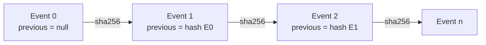

# Design contracts

This page records the intended contract surface without promoting draft PR #7 to accepted status. When code and documentation disagree, the accepted commit and its reviewed tests control. Any change to a canonical form, schema, hash, lifecycle transition, or rollback rule is a compatibility change that requires explicit migration evidence.

## Canonical data

Every hash-bearing value must have one defined canonical representation.

Candidate canonical JSON rules are:

- UTF-8 text only;
- JSON objects with string keys;
- no duplicate keys;
- no `NaN`, positive infinity, or negative infinity;
- finite numbers only;
- exact type checks where Boolean values must not satisfy integer fields;
- deterministic key ordering and compact separators before SHA-256;
- no implicit path, case, name, or identifier normalization after validation.

A digest is evidence about bytes produced by a canonicalization rule. It is not evidence that the underlying claim is true or approved.

## Identity contract

A local QSO instance is expected to bind:

- an explicit schema version;
- a canonical lower-case instance ID;
- one primary role name from Atlas, Nova, Orion, or Lyra;
- a bounded secondary name;
- a declared lineage name derived from the accepted naming rule;
- a version;
- a genome repository, path, schema version, and eventual accepted SHA-256;
- identity-declaration, development, review, and status fields;
- explicit human review requirements.

Identity aliases must not silently widen recipient, reviewer, release, or runtime authority. Retired identities require a migration record and must fail closed where the accepted contract no longer permits them.

## Genome contract

A genome is declarative input, not executable code. The prototype expects these top-level areas:

- `genome_id`;
- `purpose`;
- `immutable`;
- `mutable`;
- `resources`;
- `freeze`;
- `communication`;
- `learning`.

The immutable section must preserve the required forbidden-capability set. The learning boundary must accept external knowledge only through the approved QSO-SEEKER canonical-record contract. A genome reference is trustworthy only when repository, normalized path, schema version, canonicalization rule, accepted artifact identity, and SHA-256 all agree.

## Configuration contract

A runtime configuration must:

1. be a bounded regular file and not a symbolic link;
2. decode as strict UTF-8;
3. parse as unambiguous canonical JSON;
4. contain the exact expected top-level and nested fields;
5. describe exactly the required QSO set with no duplicates;
6. use canonical IDs, names, paths, versions, enum values, and integer fields;
7. bind genome references to the approved repository and paths;
8. fail closed when a required hash is absent or mismatched for a stage that requires resolution;
9. produce one deterministic configuration SHA-256;
10. remain immutable after acceptance into a runtime construction step.

Configuration validation does not authorize runtime activation. It only establishes that the local declaration satisfies the candidate parser contract.

## Canonical record contract

A canonical external record is data-only and must include, at minimum:

- content;
- content SHA-256;
- flags;
- transformations.

The accepted cross-repository version should additionally bind source identity, source repository and path where applicable, retrieval time, parser and sanitizer versions, policy version, taint status, provenance links, disposition, and schema version. Those additional fields must come from the accepted QSO-SEEKER contract rather than being invented independently here.

Before ingest, the runtime must verify shape, types, canonical JSON compatibility, content digest, source authority, and resource limits. A failed ingest must leave records, counters, queues, proposals, ledgers, and checkpoints unchanged.

## Message contract

A message contains:

- sender;
- recipient;
- kind;
- payload;
- SHA-256 over the canonical message body.

The prototype message kinds are `proposal`, `critique`, `annotation`, and `vote`. Candidate validation must reject unknown kinds, malformed payloads, non-canonical values, unknown senders, unknown recipients, unauthorized peers, digest mismatches, oversized messages, and duplicate/replayed messages where the versioned contract requires replay protection.

```mermaid
sequenceDiagram
    participant Sender
    participant Gate as Message gate
    participant Receiver
    participant Ledger

    Sender->>Gate: canonical message
    Gate->>Gate: validate shape, identity, kind, payload, allowlist, digest, limits
    alt invalid
        Gate-->>Sender: reject; state unchanged
    else valid
        Gate->>Receiver: enqueue accepted copy
        Gate->>Ledger: append attributable event
    end
```

A message is not a command merely because its payload uses imperative language.

## Proposal contract

Generated proposals remain inactive text. A proposal may describe code, architecture, or a candidate action, but it must record:

- producing QSO identity;
- title and rationale;
- source evidence references;
- source digest;
- language or media type;
- proposal digest;
- inactive execution status;
- required review state.

No proposal may directly execute code, modify repositories, invoke tools, use credentials, access a network, activate a deployment, or approve itself.

## Event ledger contract

Each event entry should have an exact versioned shape containing:

- integer sequence number;
- stable QSO identity;
- non-empty event kind;
- canonical JSON payload;
- previous-event SHA-256 or `null` for the first event;
- current event SHA-256.

Verification must reject wrong key types, missing or extra fields, Boolean or non-integer sequences, sequence gaps, identity changes, non-object payloads, non-canonical values, broken previous hashes, malformed digests, and current-hash mismatches.



A valid hash chain establishes internal tamper evidence for the represented entries. It does not prove that omitted events never occurred unless the complete mutation path is also enforced.

## Attribution journey contract

Attribution evidence should answer:

- What source entered the system?
- Which accepted record represents it?
- What transformations were applied?
- Which QSO consumed it?
- Which event, claim, critique, or proposal used it?
- What policy and schema versions governed the transition?
- What reviewer disposition was recorded?

Attribution entries must be append-only, hash-bound, and distinct from ordinary runtime events so that provenance queries do not depend on interpreting free-form event payloads.

## Resource contract

Resource limits must be explicit, integer-typed, bounded, and applied before mutation. Candidate examples include maximum records, events, messages, proposals, bytes, and runtime duration.

Rules:

- Boolean values are not integers for limit fields;
- explicit zero must not be replaced by a truthiness-based default when zero is permitted;
- rejected operations must not consume permanent capacity;
- safety and rollback evidence must retain reserved capacity or use an invariant-safe recovery path;
- exceeding a limit must stop the operation before unledgered partial state exists.

## Checkpoint contract

A checkpoint must represent the complete mutable state required for deterministic restoration, including any message queues that affect future behavior. It should bind:

- canonical state;
- state SHA-256;
- event-ledger head or ledger SHA-256;
- schema and checkpoint versions;
- creation reason and event reference;
- QSO identity;
- resource counters needed for consistent restoration.

All freeze, resume, interruption, recovery, annotation review, and rollback paths must use the same canonical checkpoint model. Competing partial snapshots are not acceptable.

## Freeze contract

Freeze is a review boundary, not a release or commit action. A successful freeze should:

1. validate annotations and current state;
2. capture one canonical checkpoint;
3. append linked freeze evidence;
4. enter the versioned frozen lifecycle state;
5. prevent mutations not explicitly allowed while frozen;
6. return a digest-bound review record.

A severe accepted annotation may trigger rollback instead. Severity values and their effects must be versioned and type-checked; arbitrary strings must not silently acquire control authority.

## Interruption and recovery contract

An interruption must be explicit, attributable, and evidence-preserving. Recovery requires:

- an allowed current state;
- a valid checkpoint and ledgers;
- verified configuration and identity;
- an approved recovery reason;
- successful deterministic restoration;
- linked recovery evidence.

Any mismatch moves the path to rollback or a stopped state rather than continuing with uncertain state.

## Rollback contract

Rollback restores the last accepted canonical checkpoint and records why restoration occurred. It must work even when ordinary event capacity is exhausted. After rollback:

- mutable state matches the checkpoint;
- queues and counters match the checkpoint contract;
- evidence identifies the rejected operation or review decision;
- no external side effect has occurred;
- the runtime does not resume automatically without an allowed transition.

## Determinism contract

For the same accepted code, configuration, genome artifacts, canonical records, seed, operation sequence, and resource limits, repeated local runs should produce the same canonical state and evidence hashes.

Determinism reports must record all inputs that can affect output. Wall-clock timestamps, random sources, platform-dependent paths, unordered collections, locale, and environment-derived values must either be excluded, normalized, or explicitly versioned.

## Compatibility rules

An incompatible change includes:

- changing required or allowed fields;
- changing accepted types or enum values;
- changing canonical JSON rules;
- changing identity, path, or naming normalization;
- changing hash input shape;
- changing lifecycle transitions;
- changing checkpoint contents;
- changing rollback effects;
- changing ledger ordering or chain rules;
- changing cross-repository source authority.

Such changes require a new schema or contract version, migration guidance, positive and negative fixtures, old/new reader behavior, coordinated consumer updates, and rollback evidence.
