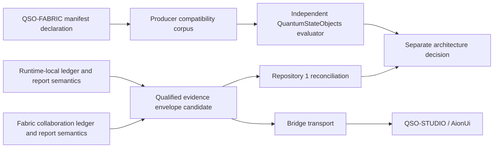

# Ecosystem interface compatibility and namespace boundary

## Status

This is the canonical QuantumStateObjects architecture record for the `qso-event-ledger` and `qso-runtime-report` interface family.

The branch now contains an independently implemented consumer of QSO-FABRIC's exact 17-case synthetic compatibility corpus. That closes one evidence sub-gate at the recorded generation only. It does not change runtime behavior, accept payload schemas, resolve the namespace collision, admit a component, grant a capability, publish an interface, merge a pull request, release a package, or authorize deployment.

The governing disposition remains **`BLOCKED_ROLE_COLLISION`**.

## Immutable source and evidence tuple

The observed producer generation is pinned to:

| Field | Value |
|---|---|
| Producer repository | `aevespers2/QSO-FABRIC` |
| Producer pull request | `#21` |
| Producer commit | `25036a5cfcea79e204a4660ddd1af09c054935b1` |
| Manifest path | `qso.manifest.json` |
| Manifest Git blob | `5070ac6615b8127b14a9f230678f58a081c6c2c4` |
| Manifest SHA-256 | `c5e6d2e42fdbe9703d9f28c7f65ffff02208bff52fa96ee7090bfcbcb5dea728` |
| Manifest byte size | `1564` |
| Compatibility corpus | `fixtures/qso-interface-compatibility-v1.json` |
| Corpus Git blob | `143b80448cb4623682669ab8e6a9599239dd5847` |
| Producer workflow | Interface Compatibility Conformance `29986841042` |
| Producer artifact | `8555344357` |
| Artifact digest | `sha256:09be1df24f4ab8b08708dd521c6720f4c95195d3e4379cecaad6d1a4b026a238` |
| Evidence expiry | October 21, 2026 |

QuantumStateObjects binds that tuple in `contracts/qso-interface-source-tuple-v1.json`, carries the exact corpus bytes, and evaluates them through `tools/validate_fabric_interface_compatibility.py` without importing the producer validator.

Any change to the producer commit, manifest, corpus, contract generation, local fixture, consumer implementation, tests, workflow, artifact, or evidence availability reopens the synthetic-conformance gate.

## Observed declarations

The producer manifest declares two interfaces:

- `qso-event-ledger` using `append-only-json`, schema `1.0.0`, idempotent operation, and retry limit `0`;
- `qso-runtime-report` using `json-file`, schema `1.0.0`, idempotent operation, and retry limit `0`.

The synthetic corpus tests source currency, interface identity, producer and consumer roles, protocol, schema generation, idempotency, retry policy, default-deny behavior, correction, rollback, evidence binding, and authority non-promotion.

Its positive disposition is `COMPATIBLE_PENDING_ARCHITECTURE_APPROVAL`. This does not override the semantic ownership obstruction described below.

## Material obstruction

QuantumStateObjects documents local ownership of runtime events, attribution, checkpoints, execution receipts, and resulting-state evidence. QSO-FABRIC independently declares itself a producer of `qso-event-ledger` and `qso-runtime-report`. The shared names therefore do not yet identify one unambiguous semantic object.

```text
same interface name
+ multiple producer candidates
+ no accepted namespace owner
+ no accepted record-envelope schema
= role and semantic collision
```

Byte-identical fixtures and independent agreement prove that two implementations understand the proposed declaration-level obstruction corpus. They do **not** prove that a runtime-local event, Fabric collaboration event, runtime execution report, Fabric aggregate report, or Repository `1` disposition can be safely represented by the current interface names.

## Candidate semantic separation

| Record class | Candidate owner | Required identity |
|---|---|---|
| Runtime-local event ledger | QuantumStateObjects | runtime, QSO instance, event sequence, schema, previous hash, current hash |
| Fabric collaboration ledger | QSO-FABRIC | fabric run, participant set, round, message/event class, schema, previous hash, current hash |
| Runtime execution report | QuantumStateObjects | admission, task, capability, runtime head, pre/post state, resource use, cleanup, rollback |
| Fabric aggregate report | QSO-FABRIC | fabric run, accepted inputs, participant outputs, collaboration result, evidence bundle |
| Canonical disposition | Repository `1` candidate | reviewed receipt/result identity, disposition, correction or recovery lineage |

An accepted design may use different interface names or one shared envelope with mandatory producer and semantic-class fields. It may not allow one name to collapse these record classes into a single status.

## Candidate namespace profiles

Three designs remain possible:

1. **Separate names**
   - `qso-runtime-event-ledger`
   - `qso-fabric-event-ledger`
   - `qso-runtime-execution-report`
   - `qso-fabric-run-report`

2. **Qualified names**
   - `qso-event-ledger/runtime`
   - `qso-event-ledger/fabric`
   - `qso-runtime-report/local-execution`
   - `qso-runtime-report/fabric-aggregate`

3. **Shared envelope with mandatory semantic partitioning**
   - exact `producer_component`;
   - exact `semantic_class`;
   - exact `subject_id` and `run_id`;
   - schema and canonicalization versions;
   - source and payload digests;
   - correction, supersession, revocation, and rollback references.

No option is accepted by this document. Architectural review must choose one and assign migration ownership.

## Evidence and authority graph



Prose alternative: QSO-FABRIC's manifest and synthetic corpus are independently evaluated by QuantumStateObjects. Separately, runtime-local records and Fabric-level records remain distinct semantic sources that may later enter a qualified evidence envelope. Bridge may transport evidence to read-only interfaces, and Repository `1` may reconcile it. None of those paths accepts the namespace or creates authority; a separate architecture decision remains required.

## Compatibility invariants

Every accepted compatibility profile must prove:

1. interface names and semantic classes are globally unambiguous within the registered portfolio generation;
2. producer, consumer, subject, run, schema, canonicalization, and payload identities are explicit;
3. Boolean values do not satisfy integer fields;
4. duplicate keys, non-finite values, unknown fields, unsupported versions, malformed hashes, and ambiguous Unicode fail closed;
5. `idempotent: true` defines the idempotency key and duplicate outcome rather than merely asserting a property;
6. `retry_limit: 0` means no automatic replay and does not suppress correction or recovery records;
7. rejected records cause no runtime, Fabric, Bridge, interface, or canonical-state mutation;
8. corrections and revocations append compensating evidence and invalidate downstream caches or projections where applicable;
9. runtime success and Fabric acceptance remain distinct from Repository `1` canonical reconciliation;
10. migration and rollback preserve old evidence and identify every affected consumer.

## Independent synthetic-conformance boundary

The local consumer must continue to:

- verify producer repository, pull request, exact head, fixture path, Git blob, workflow, artifact, digest, and evidence expiry before semantic use;
- use strict UTF-8 and JSON parsing with duplicate-key, non-finite, overflow, closed-field, and exact-Boolean controls;
- independently derive all 17 dispositions and 14 ordered obstruction reasons;
- reject source-tuple, fixture-byte, fact-order, reason-order, case-identity, disposition, and reason drift;
- preserve `authority_effect: none`;
- retain exact-head evidence.

The bounded synthetic disposition is:

`EVIDENCE_SATISFIED_AT_RECORDED_SYNTHETIC_TUPLE`

It does not change `BLOCKED_ROLE_COLLISION` for real payload integration.

## Required payload fixtures

### `qso-event-ledger`

Positive fixtures must cover:

- one valid runtime-local event chain;
- one valid Fabric collaboration event chain;
- stable canonical bytes and hashes;
- duplicate delivery with the documented idempotency outcome;
- explicit correction and revocation linkage.

Negative fixtures must cover:

- producer missing or inconsistent with semantic class;
- runtime and Fabric sequence spaces accidentally merged;
- wrong previous hash, sequence gap, reorder, truncation, replay, or duplicate key;
- unsupported schema or canonicalization version;
- unknown event class or subject;
- stale, corrected, revoked, or superseded evidence treated as current.

### `qso-runtime-report`

Positive fixtures must cover:

- one valid runtime execution report;
- one valid Fabric aggregate report;
- deterministic source and payload hashes;
- explicit partial-failure, cleanup, rollback, and uncertainty fields;
- separate Repository `1` disposition.

Negative fixtures must cover:

- Fabric aggregate output mislabeled as local runtime execution;
- runtime success mislabeled as architecture or canonical approval;
- missing admission, capability, task, participant, or run identity;
- post-state mismatch, incomplete cleanup, hidden partial failure, or invalid rollback reference;
- retry or duplicate handling inconsistent with the registered contract.

## Required triple-overlap witnesses

Pairwise compatibility is insufficient. The portfolio requires deterministic witnesses for:

1. runtime event ledger → Fabric collaboration ledger → Repository `1` reconciliation;
2. runtime execution report → Fabric aggregate report → Repository `1` disposition;
3. runtime evidence → Bridge transport → QSO-STUDIO/AionUi display;
4. correction or revocation → downstream invalidation → bounded recovery;
5. schema migration → mixed-version consumer set → rollback to the last accepted generation.

Each witness must preserve all record identities and prove that no intermediate component can promote evidence into authority.

## Migration and rollback

An incompatible change includes any change to interface name, semantic class, producer role, protocol, schema version, canonicalization, idempotency key, retry semantics, ordering, hash input, correction behavior, revocation behavior, or authority interpretation.

A migration requires:

- old and new producer fixtures;
- old and new consumer fixtures;
- a mixed-version compatibility matrix;
- explicit unsupported combinations;
- correction and supersession propagation;
- cache and projection invalidation;
- rollback to the last accepted registry generation;
- retained evidence for the failed or superseded generation.

## Skill-tree capability map

The work uses the FYSA-120 taxonomy only as a planning map:

| Category and subdivision | Applied capability |
|---|---|
| `CAT-012 / 012-A` | audience paths, information hierarchy, navigation, and template structure |
| `CAT-012 / 012-B` | API documentation, requirements specification, and decision-record writing |
| `CAT-012 / 012-D` | terminology consistency, example validation, link checking, and ambiguity review |
| `CAT-012 / 012-E` | docs-as-code, version synchronization, deprecation, and changelog alignment |
| `CAT-017 / 017-C` | claim-source graphs, derivation chains, and transformation logging |
| `CAT-017 / 017-E` | source hashing, audit packages, and correction propagation |
| `CAT-031 / 031-A` | invariants, contract design, state-machine boundaries, and threat-aware criteria |
| `CAT-031 / 031-D` | integration, fuzz, differential, and runtime-verification planning |
| `CAT-031 / 031-E` | change-impact analysis, regression prevention, and assurance maintenance |
| `CAT-032` | distributed interface composition and failure containment |
| `CAT-040 / 040-D` | compatibility layers, parallel-run validation, and migration planning |
| `CAT-040 / 040-E` | behavioral equivalence, rollback planning, and post-migration monitoring |
| `CAT-044` | hostile independent evaluation and reason/disposition convergence |
| `CAT-054 / 054-A` | asset, trust, identity, attack-surface, and risk modeling |
| `CAT-054 / 054-E` | control validation, audit evidence, and continuous assurance |
| `CAT-059 / 059-B` | secure attestation architecture and least-privilege transport |
| `CAT-059 / 059-E` | evidence transport validation and continuous assurance |

Taxonomy selection does not establish demonstrated competence, accepted architecture, or operational authority.

### Proposed subdivisions

These are non-authoritative proposals for later taxonomy review:

- `012-I` — cross-repository API and interface lifecycle documentation;
- `017-H` — multi-producer semantic provenance and namespace lineage;
- `031-H` — independent interface differential-conformance testing;
- `032-F` — semantic partitioning and distributed interface gluing;
- `040-F` — portfolio contract migration and consumer-rebinding assurance;
- `059-G` — evidence-envelope semantic partitioning and attestation rebinding.

## Architectural decisions required

Before implementation or acceptance, appoint owners and decide:

1. whether interface names are separate, qualified, or envelope-partitioned;
2. whether QuantumStateObjects or QSO-FABRIC owns each ledger and report schema;
3. the canonical producer, subject, run, semantic-class, and idempotency identities;
4. correction, revocation, supersession, replay, retention, and rollback semantics;
5. registry, schema, canonicalization, signing, key, trusted-time, and migration custody;
6. controlled consumer registration and independent conformance requirements;
7. privacy, licensing, security, accessibility, release, publication, and resulting-default-branch approval.

```text
independent synthetic agreement
!= namespace resolved
!= payload schema accepted
!= producer registered
!= consumer integration accepted
!= ecosystem admission
!= capability or execution authority
!= merge, release, publication, or deployment approval
```
