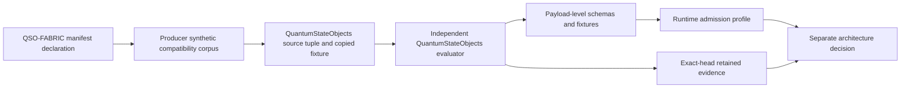

# QSO-FABRIC interface compatibility review

Status: **producer corpus and source tuple bound; independent runtime consumer and payload schemas pending**

QuantumStateObjects is the candidate local runtime and evidence producer/consumer boundary. QSO-FABRIC draft PR #21 publishes a synthetic compatibility profile for the two interfaces declared in its ecosystem manifest:

- `qso-event-ledger` using `append-only-json`, schema generation `1.0.0`, idempotent operation, and retry limit `0`;
- `qso-runtime-report` using `json-file`, schema generation `1.0.0`, idempotent operation, and retry limit `0`.

This page is the single human-readable compatibility route. Its companion controls are the [machine-readable documentation profile](ecosystem-interface-compatibility-v0.json), [review checklist](ecosystem-interface-compatibility-review-checklist.md), and [ADR-0001](decisions/0001-ecosystem-interface-compatibility-boundary.md).

## Immutable producer observation

| Field | Value |
|---|---|
| Repository | `aevespers2/QSO-FABRIC` |
| Pull request | `#21` |
| Producer head | `25036a5cfcea79e204a4660ddd1af09c054935b1` |
| Fixture path | `fixtures/qso-interface-compatibility-v1.json` |
| Fixture Git blob | `143b80448cb4623682669ab8e6a9599239dd5847` |
| Contract | `QSO-INTERFACE-COMPATIBILITY-001@1.0.0` |
| Producer workflow | Interface Compatibility Conformance `29986841042` |
| Retained artifact | `8555344357` |
| Artifact digest | `sha256:09be1df24f4ab8b08708dd521c6720f4c95195d3e4379cecaad6d1a4b026a238` |
| Evidence expiry | October 21, 2026 |

QuantumStateObjects carries the exact fixture bytes and a machine-readable source tuple. This binds the producer observation but does not complete the planned independent consumer at `tools/validate_fabric_interface_compatibility.py`, its tests, or its exact-head workflow.

## Producer corpus boundary

The fixture contains:

- 17 positive and hostile cases;
- 14 Boolean compatibility facts;
- 14 ordered obstruction reasons;
- positive disposition `COMPATIBLE_PENDING_ARCHITECTURE_APPROVAL`;
- adverse disposition `BLOCKED`.

A future consumer must derive those outcomes independently. Copying the fixture or producer validator is not independent conformance.

## Compatibility graph



Equivalent prose: the Fabric manifest declares the interface names and coarse protocol properties. The producer corpus expresses a closed synthetic compatibility fact surface. QuantumStateObjects binds the exact producer tuple and fixture but must still implement its own evaluator without importing producer code. Declaration-level agreement then feeds a separate payload-schema and fixture stage. Only payload conformance, local runtime-admission evidence, independent retention, and a separately governed architecture decision can accept a real interface generation.

## Required independent-consumer behavior

The runtime consumer must:

1. verify the producer repository, pull request, exact head, fixture path, Git blob, workflow run, artifact digest, and availability before semantic parsing;
2. use strict UTF-8 and JSON parsing with duplicate-key and non-finite-number rejection;
3. independently derive all 17 expected case outcomes and the 14 ordered obstruction reasons;
4. reject unknown fields, missing facts, non-Boolean facts, duplicate case identifiers, fact/reason-order drift, and disposition drift;
5. preserve the separation between a compatible synthetic case and runtime admission, Fabric acceptance, Repository `1` reconciliation, merge, release, publication, deployment, or operational authority;
6. retain exact-head evidence and fail closed if the producer tuple moves, is corrected, is superseded, or expires.

## Unresolved payload-contract obstruction

The producer profile proves compatibility only over declaration-level facts. The portfolio still lacks accepted payload schemas and canonical bytes for:

- event identities, sequence, causal order, record boundaries, and hash-chain semantics;
- producer, object, subject, run, policy, genome, capability, and source identities;
- append-only correction, revocation, supersession, and withdrawal records;
- duplicate, replay, conflict, truncation, reorder, and tamper handling;
- report-to-ledger references and completeness claims;
- partial failure, cleanup, uncertainty, and rollback fields;
- privacy, classification, retention, redaction, deletion, and withdrawal;
- checkpoint, freeze, rollback, recovery, and restored-state verification;
- namespace, canonicalization, migration, consumer-rebinding, and rollback ownership.

Until those fields are accepted, the runtime must not represent either interface as integration-ready.

## Semantic separation requirement

The lowest-coupling interpretation preserves five different record classes:

| Record class | Candidate owner |
|---|---|
| Runtime-local event ledger | QuantumStateObjects |
| Fabric collaboration ledger | QSO-FABRIC |
| Runtime execution report | QuantumStateObjects |
| Fabric aggregate report | QSO-FABRIC |
| Canonical disposition | Repository `1` candidate |

Architecture review must choose separate names, qualified names, or a shared envelope with mandatory producer and semantic-class partitioning. No option is selected here.

## Gluing witnesses required

A later implementation must provide at least these witnesses:

- genome identity → runtime admission → event-ledger record;
- event-ledger record → runtime report → Fabric receipt;
- correction → downstream invalidation → corrected report;
- capability revocation → runtime freeze → final ledger/report evidence;
- rollback checkpoint → restored runtime → independent Repository `1` reconciliation;
- runtime evidence → Bridge transport → QSO-STUDIO/AionUi read-only projection.

## Migration and rollback

Any change to interface name, semantic class, role, protocol, schema, canonicalization, idempotency, retry, ordering, hash input, correction, revocation, retention, or authority interpretation is incompatible unless a versioned migration proves otherwise.

Migration requires old/new producer and consumer fixtures, a mixed-version matrix, explicit unsupported combinations, correction and supersession propagation, consumer rebinding, cache invalidation, rollback to the last accepted generation, and preserved failed-candidate evidence.

## Skill-tree mapping

Applied FYSA-120 capability nodes:

- `CAT-012/012-A`, `012-B`, `012-D`, `012-E` — information architecture, API exposition, quality controls, and docs lifecycle;
- `CAT-017/017-C`, `017-E` — source graphs, derivation chains, hashing, audit packages, and correction propagation;
- `CAT-031/031-A`, `031-D`, `031-E` — contract invariants, differential testing, change impact, and assurance maintenance;
- `CAT-040/040-D`, `040-E` — compatibility migration, parallel validation, rollback, and post-migration monitoring;
- `CAT-054/054-A`, `054-E` — trust modeling, interface risk, control validation, and continuous assurance;
- `CAT-059/059-B`, `059-E` — secure evidence transport, attestation validation, and audit evidence.

Proposed subdivisions:

- `012-I` — cross-repository API and interface lifecycle documentation;
- `017-H` — multi-producer semantic provenance and namespace lineage;
- `031-H` — independent interface differential-conformance testing;
- `040-F` — portfolio contract migration and consumer-rebinding assurance;
- `059-G` — evidence-envelope semantic partitioning and attestation rebinding.

Taxonomy selection is a planning map, not evidence of competence or authority.

## Authority boundary

```text
producer corpus and source tuple bound
!= independent consumer complete
!= payload schema accepted
!= runtime admission approved
!= Fabric integration approved
!= Repository 1 canonical acceptance
!= merge, release, publication, deployment, or operational authority
```

This page changes no runtime code, accepted schemas, credentials, network access, repository permissions, canonical state, release status, or deployment authority.
