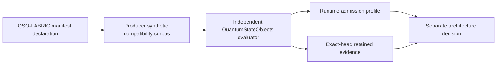

# QSO-FABRIC interface compatibility review

Status: **independent runtime consumer candidate implemented; architecture acceptance remains blocked**

QuantumStateObjects is the candidate local runtime and evidence producer/consumer boundary. QSO-FABRIC draft PR #21 publishes a synthetic compatibility profile for the two interfaces declared in its ecosystem manifest:

- `qso-event-ledger` using `append-only-json`, schema generation `1.0.0`, idempotent operation, and retry limit `0`;
- `qso-runtime-report` using `json-file`, schema generation `1.0.0`, idempotent operation, and retry limit `0`.

QuantumStateObjects now carries a byte-identical fixture and an independently implemented evaluator. It does not import the QSO-FABRIC validator.

## Immutable producer observation

| Field | Value |
|---|---|
| Repository | `aevespers2/QSO-FABRIC` |
| Pull request | `#21` |
| Producer head | `25036a5cfcea79e204a4660ddd1af09c054935b1` |
| Fixture path | `fixtures/qso-interface-compatibility-v1.json` |
| Fixture Git blob | `143b80448cb4623682669ab8e6a9599239dd5847` |
| Contract | `QSO-INTERFACE-COMPATIBILITY-001@1.0.0` |
| Producer workflow | Interface Compatibility Conformance `29986841042` |
| Retained artifact | `8555344357` |
| Artifact digest | `sha256:09be1df24f4ab8b08708dd521c6720f4c95195d3e4379cecaad6d1a4b026a238` |
| Evidence expiry | October 21, 2026 |

This tuple is an observation of one draft producer generation. It is not an accepted source registry, payload-schema approval, or ecosystem-admission decision.

## Consumer implementation

The candidate adds:

- `contracts/qso-interface-source-tuple-v1.json`;
- a byte-identical local copy of the 17-case producer fixture;
- `tools/validate_fabric_interface_compatibility.py`, implemented independently;
- hostile regression coverage for source-tuple drift, parser ambiguity, closed fields, Boolean typing, case identity, order, disposition, reason, fixture-byte, and authority boundaries;
- a SHA-pinned, read-only exact-head workflow with retained evidence.

The bounded disposition is `EVIDENCE_SATISFIED_AT_RECORDED_SYNTHETIC_TUPLE` only after all exact-head workflow gates pass. Any producer head, fixture blob, contract generation, local fixture, validator, test, workflow, or evidence-binding change reopens the gate.

## Compatibility graph



Equivalent prose: the Fabric manifest declares the interface names and coarse protocol properties. The producer corpus expresses a closed synthetic compatibility fact surface. QuantumStateObjects independently evaluates the exact producer bytes, connects the result to its local runtime-admission documentation, and retains exact-head evidence. Only a separately governed architecture decision may accept a real interface generation.

## Independent-consumer behavior

The runtime consumer:

1. verifies the producer repository, pull request, exact head, fixture path, Git blob, and contract generation before semantic parsing;
2. uses strict UTF-8 and JSON parsing with duplicate-key and non-finite-number rejection;
3. independently derives all 17 expected case outcomes and the 14 ordered obstruction reasons;
4. rejects unknown fields, missing facts, non-Boolean facts, duplicate case identifiers, fact/reason-order drift, disposition drift, source-tuple drift, and changed fixture bytes;
5. preserves the separation between a compatible synthetic case and runtime admission, Fabric acceptance, Repository `1` reconciliation, merge, release, publication, deployment, or operational authority;
6. retains exact-head evidence and fails closed if the producer tuple moves or expires.

## Unresolved payload-contract obstruction

The profile proves compatibility only over declaration-level facts. The portfolio still lacks accepted payload schemas and canonical bytes for:

- event identities, sequence and causal order;
- producer, object, run, policy, genome, capability, and source identities;
- append-only correction and supersession records;
- duplicate, replay, conflict, truncation, and tamper handling;
- report-to-ledger references and completeness claims;
- privacy, classification, retention, redaction, and withdrawal;
- checkpoint, freeze, rollback, recovery, and restored-state verification.

Until those fields are accepted, the runtime must not represent either interface as integration-ready.

## Gluing witnesses required

A later payload implementation must provide at least these witnesses:

- genome identity → runtime admission → event-ledger record;
- event-ledger record → runtime report → Fabric receipt;
- correction → downstream invalidation → corrected report;
- capability revocation → runtime freeze → final ledger/report evidence;
- rollback checkpoint → restored runtime → independent Repository `1` reconciliation.

## Skill-tree mapping

Applied FYSA-120 capabilities:

- `CAT-012` — technical documentation and developer guidance;
- `CAT-017` — immutable producer-source provenance;
- `CAT-031` — independent conformance implementation and regression testing;
- `CAT-032` — distributed interface composition;
- `CAT-040` — correction, migration, rollback, and recovery planning;
- `CAT-044` — hostile and adversarial validation;
- `CAT-052` — Git-blob and digest provenance;
- `CAT-054` — cross-repository supply-chain verification;
- `CAT-059` — exact-head attestation and retained evidence.

Proposed subdivision: **cross-repository interface differential conformance**, covering independent evaluators, replay/conflict semantics, correction propagation, rollback witnesses, and reason/disposition convergence.

## Authority boundary

```text
independent synthetic agreement
!= payload schema accepted
!= runtime admission approved
!= Fabric integration approved
!= Repository 1 canonical acceptance
!= merge, release, publication, or deployment authority
```

This candidate changes no runtime code, accepted schemas, credentials, network access, repository permissions, canonical state, release status, or deployment authority.
