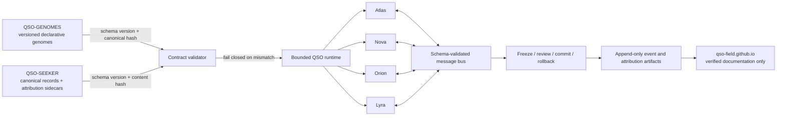

# QuantumStateObjects

QuantumStateObjects is the bounded runtime-definition repository for four experimental Quantum State Objects: **Atlas**, **Nova**, **Orion**, and **Lyra**. It defines the object identities, runtime partitions, freeze and rollback controls, bounded inter-object messages, deterministic experiment requirements, event evidence, and attribution-journey records.

> **Current maturity:** pre-release research prototype. The repository must not claim a verified multi-object run until its local baseline passes and the upstream contracts from `QSO-GENOMES` and `QSO-SEEKER` are versioned, hashed, and validated.

## Repository boundary

This repository owns:

- QSO instance definitions and runtime partitions;
- immutable references to externally supplied genome and canonical-record contracts;
- deterministic seeds and bounded resource settings;
- freeze, review, commit, and rollback control points;
- schema-validated inter-object messages;
- append-only event and attribution evidence.

This repository does **not** own:

- declarative genome source files or immutable ethics (`QSO-GENOMES`);
- network retrieval, hostile-input sanitization, or canonical-record production (`QSO-SEEKER`);
- public portfolio documentation (`qso-field.github.io`);
- production payment execution, custody, credentials, or settlement authority.

## Initial objects

| QSO | Primary emphasis | Required boundary |
|---|---|---|
| Atlas | Mathematics, structure, algorithms, compression, and cross-domain mapping | Produces bounded proposals and evidence; no unrestricted computation authority |
| Nova | Verification, anomaly detection, testing, security, and contradiction analysis | Cannot silently convert uncertainty into fact |
| Orion | Architecture, interfaces, protocols, and systems composition | Cannot expand interfaces beyond approved contracts |
| Lyra | Language, ontology, epistemology, documentation, and human context | Must preserve source attribution and distinguish interpretation from observation |

## Contract and evidence flow

## Required experiment invariants

A conforming experiment must:

1. load only versioned, hash-verified external contracts;
2. reject missing, incompatible, or altered contracts before execution;
3. use deterministic seeds and declared time, memory, and message limits;
4. keep proposals inert until an external controller approves them;
5. stop at configured freeze points and preserve rollback evidence;
6. emit append-only event and attribution artifacts;
7. separate observations, inferences, hypotheses, goals, and decisions;
8. require human review before research outputs are reused.

## Delivery sequence

1. **Baseline:** inventory current manifests, interpreter, tests, limits, ledger, and freeze/rollback path.
2. **Contract validation:** consume the published `QSO-GENOMES` and `QSO-SEEKER` fixtures without importing their code.
3. **Bounded runner:** execute Atlas, Nova, Orion, and Lyra under deterministic limits.
4. **Optional economic records:** add simulation-only intent and distribution records after a separately approved policy contract.
5. **Public documentation:** publish only behavior supported by committed evidence.

## Release gates

No release is ready until all of the following are evidenced for the candidate commit:

- repository-specific task acceptance criteria are complete;
- build, tests, static checks, and deterministic smoke tests pass;
- security and secret checks pass with least-privilege workflow permissions;
- contract versions and hashes are recorded;
- documentation matches implemented behavior;
- provenance includes commands, tool versions, seeds, artifact hashes, and rollback evidence;
- public privacy, confidentiality, and licensing decisions are approved.

## Documentation map

- [Architecture](architecture.md)
- [Repository task chain](../taskchain.md)
- [Release plan](../release.md)
- [Changelog](../changelog.md)
- [Root overview](../README.md)
