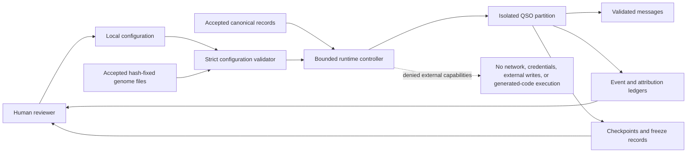

# QuantumStateObjects

QuantumStateObjects is a bounded research repository for defining, validating, and exercising auditable Quantum State Object runtime primitives.

Within A.L.I.S.T.A.I.R.E., it is the local execution and evidence subsystem: accepted identities, genomes, configuration, and canonical records enter a constrained runtime; inactive proposals, events, attribution, checkpoints, freeze decisions, and rollback evidence leave for review. It is not the portfolio strategy, autonomous-development control plane, credential authority, merge/release/deployment service, or final approval authority.

The project separates declarative identity and genome material from runtime state, treats external content as untrusted data, records integrity evidence, and keeps generated proposals inactive until explicit review. It does not authorize external network access, credentials, code execution, repository writes, financial operations, or production orchestration.

## Current status

The repository is not release-ready or deployment-ready. The accepted `main` branch contains the repository-wide policy validator and the earlier bounded prototype. Draft PR #7 remains the sole candidate path for the hardened package, CLI, configuration parser, runtime controller, ledgers, checkpoints, freeze, interruption, recovery, and rollback behavior. That candidate still requires reconciliation with current `main`, repair of open findings, exact-head and merged-head verification, upstream contract acceptance, publication evidence, and explicit approval.

## Repository purpose

The repository owns QSO identity declarations, local runtime partitions, bounded messages, integrity ledgers, checkpoints, freeze and rollback primitives, deterministic local verification, and the future integration boundary for accepted QSO-GENOMES and QSO-SEEKER artifacts.

The repository does not own genome authoring, external repository retrieval, portfolio-wide autonomous-development orchestration, settlement, production deployment, or unrestricted multi-agent operation.

## Named research roles

| QSO | Bounded role |
|---|---|
| Atlas | Mathematical structure, algorithms, compression, and cross-domain mapping |
| Nova | Verification, anomaly detection, testing, security, and contradiction analysis |
| Orion | Software architecture, interfaces, protocols, and systems composition |
| Lyra | Language, documentation, ontology, epistemology, and human context |

These are role definitions, not claims that four autonomous systems are currently running.

## Capability map

| Capability | Status | Meaning |
|---|---|---|
| Declarative QSO roles and boundaries | Implemented on `main` | Present in repository documentation and prototype code |
| Repository-wide policy validator | Accepted on `main` | Exact-head tested and merged before this documentation branch |
| Installable package and `qso-run` CLI | Candidate in PR #7 | Draft, unmerged, and not release-authorized |
| Strict local configuration validation | Candidate in PR #7 | Under active correctness review |
| Runtime controller and integrity ledgers | Candidate in PR #7 | Tested historically; current accepted-head evidence is incomplete |
| A.L.I.S.T.A.I.R.E. subsystem contract | Documentation candidate | Runtime/evidence role and denied authority are explicit; portfolio control-plane owner remains unresolved |
| QSO-GENOMES integration | Blocked | Requires an accepted compatibility set with fixed hashes |
| QSO-SEEKER integration | Blocked | Requires an accepted canonical-record and attribution contract |
| Four-QSO experiment | Proposed | Must not run before prerequisite gates pass |
| Autonomous-development control-plane integration | Blocked | Requires an explicitly designated owner and authority contract |
| Package publication or persistent deployment | Blocked | Requires security, privacy, licensing, provenance, rollback, and approval evidence |

## Architecture at a glance

## Documentation map

- [Project overview](project-overview.md)
- [A.L.I.S.T.A.I.R.E. integration](alistaire-integration.md)
- [Architecture](architecture.md)
- [Design contracts](design-contracts.md)
- [Developer guide](developer-guide.md)
- [Security and trust](security.md)
- [Operations and recovery](operations.md)
- [Release status](release-status.md)

## Status vocabulary

- **Implemented** means present in a specific commit or branch.
- **Tested** means a named test or workflow passed at a named immutable head.
- **Accepted** means review findings are resolved and approval is recorded.
- **Released** means reproducible artifacts, provenance, security, rollback, and publication gates passed.
- **Deployed** means an approved target was changed and post-deployment evidence exists.

No lower state implies a higher state.
