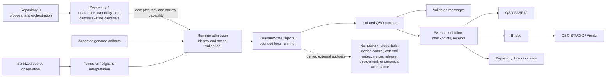

# QuantumStateObjects

QuantumStateObjects is a bounded research repository for defining, validating, and exercising auditable Quantum State Object runtime primitives.

Within A.L.I.S.T.A.I.R.E., it is the local execution and evidence subsystem: accepted identities, genomes, configuration, observations, capabilities, and task envelopes enter a constrained runtime; inactive proposals, events, attribution, checkpoints, freeze decisions, corrections, rollback records, and execution receipts leave for review. It is not constitutional governance, Repository `0` portable bootstrap or planning, Repository `1` capability or canonical-state authority, credential authority, merge/release/deployment service, or final approval authority.

The project separates declarative identity and genome material from runtime state, treats external content as untrusted data, records integrity evidence, and keeps generated proposals inactive until explicit review. It does not authorize external network access, host-security administration, credentials, code execution, repository writes, financial operations, or production orchestration.

## Current status

The repository is not release-ready or deployment-ready. Accepted `main` contains the repository-wide consent-capacity policy validator and the earlier bounded prototype. Draft PR #7 remains the sole candidate path for the hardened package, CLI, configuration parser, runtime controller, ledgers, checkpoints, freeze, interruption, recovery, and rollback behavior.

Current observed PR #7 head: `cee0bad3baacde97c99251ae6be0f0e733a381a7`. CI run `30066794450` and Consent Capacity Lock run `30066794742` passed for that exact source. Six configuration/message findings, reconciliation, complete review disposition, and resulting integrated-head validation remain open. Passing evidence does not accept the candidate.

The portfolio direction is now clearer:

- Repository `0` is the candidate portable bootstrap, planning, proposal, and maintenance-orchestration plane;
- Repository `1` is the candidate independent capability, canonical-state, revocation, and recovery authority;
- QuantumStateObjects accepts only narrow, versioned, identity-bound inputs after their contracts and fixtures are approved;
- local runtime admission, execution success, Fabric collaboration, Bridge delivery, and interface display are separate states;
- local runtime success remains evidence and never becomes canonical acceptance automatically.

## Repository purpose

The repository owns QSO identity declarations, local runtime partitions, bounded messages, integrity ledgers, checkpoints, freeze and rollback primitives, deterministic local verification, and the local compatibility boundary for accepted genome, observation, capability, and task-envelope artifacts.

The repository does not own genome authoring, external retrieval and sanitization, temporal interpretation, portable device security, portfolio-wide collaboration, generic evidence transport, canonical-state reconciliation, production deployment, or unrestricted multi-agent operation.

## Named research roles

| QSO | Bounded role |
|---|---|
| Atlas | Mathematical structure, algorithms, compression, and cross-domain mapping |
| Nova | Verification, anomaly detection, testing, security, and contradiction analysis |
| Orion | Software architecture, interfaces, protocols, and systems composition |
| Lyra | Language, documentation, ontology, epistemology, and human context |

These are local role definitions and fixtures, not claims that four autonomous systems are currently running. Accepted QSO-GENOMES identities must eventually bind the names, policy, lineage, and lifecycle semantics before runtime instantiation claims are made.

## Capability map

| Capability | Status | Meaning |
|---|---|---|
| Declarative QSO roles and boundaries | Implemented on `main` | Present in repository documentation and prototype code |
| Repository-wide consent-capacity policy validator | Accepted on `main` | Exact-head tested and merged before this documentation branch |
| Installable package and `qso-run` CLI | Candidate in PR #7 | Draft, unmerged, and not release-authorized |
| Strict local configuration validation | Candidate in PR #7 | Under active correctness review |
| Configuration/message failure-boundary profile | Documentation candidate | Defines validation order, six open findings, failure evidence, and atomicity without changing runtime behavior |
| Runtime controller and integrity ledgers | Candidate in PR #7 | Current exact-head evidence exists; integrated-head acceptance is absent |
| A.L.I.S.T.A.I.R.E. subsystem contract | Documentation candidate | Runtime/evidence role and denied authority are explicit |
| Runtime admission and reconciliation profile | Documentation candidate | Separates proposal, quarantine, capability, admission, execution, receipt, and canonical reconciliation |
| QSO-FABRIC declaration-level compatibility corpus | Independently reproduced candidate | Exact producer fixture is consumed by a separate evaluator; real namespace and payload compatibility remain blocked |
| Repository `0`/`1` governed task input | Blocked | Route is documented; schemas, shared fixtures, authority owners, and implementation are unaccepted |
| QSO-GENOMES integration | Blocked | Requires an accepted compatibility set with fixed identities and hashes |
| QSO-SEEKER and temporal/Digitalis integration | Blocked | Requires accepted source, interpretation, freshness, replay, correction, privacy, and revocation contracts |
| QSO-FABRIC and `qsio-kernel` gluing | Blocked | Lifecycle, message, format, ledger, checkpoint, freeze, namespace, and rollback ownership unresolved |
| Bridge and interface evidence path | Blocked | Requires transport, redaction, correction, privacy, retention, and read-only presentation fixtures |
| Four-QSO experiment | Proposed | Must not run before prerequisite gates pass |
| Package publication or persistent deployment | Blocked | Requires runtime, contract, security, privacy, licensing, provenance, recovery, and approval evidence |

## Architecture at a glance

## Material obstruction summary

The portfolio now has candidate records for proposals, quarantine admissions, capabilities, source observations, interpretations, execution receipts, transports, review projections, and reconciliation, but it still lacks one accepted namespace and schema set proving those records cannot collapse into a single misleading status.

At the local boundary, malformed configuration or messages can compose safely only when decode, exact shape/type, canonical identity, limit, integrity, replay, capacity, and authority checks complete before state mutation—or when complete restoration is independently proven. The current six PR #7 findings remain explicit rather than being inferred away by successful historical runs.

The QSO-FABRIC declaration-level corpus has been reproduced independently, but the names `qso-event-ledger` and `qso-runtime-report` still overlap runtime-local and Fabric-level semantics. Byte identity and matching synthetic outcomes do not resolve payload ownership. Pairwise agreement is insufficient: Repository `0` → Repository `1` → runtime, genome → runtime → Fabric, Seeker → temporal/Digitalis → runtime, runtime → Fabric → Repository `1`, runtime → Bridge → interface, and freeze → revocation → recovery all require deterministic triple-overlap witnesses.

See [Runtime admission and reconciliation profile](runtime-admission-and-reconciliation-profile.md), [Configuration and message boundaries](configuration-and-message-boundaries.md), [Ecosystem interface compatibility](ecosystem-interface-compatibility.md), and [Obstruction and gluing analysis](obstruction-and-gluing.md).

## Documentation map

- [Project overview](project-overview.md)
- [A.L.I.S.T.A.I.R.E. integration](alistaire-integration.md)
- [Runtime admission and reconciliation profile](runtime-admission-and-reconciliation-profile.md)
- [Configuration and message boundaries](configuration-and-message-boundaries.md)
- [Machine-readable configuration/message profile](configuration-message-boundary-v1.json)
- [Ecosystem interface compatibility](ecosystem-interface-compatibility.md)
- [Architecture](architecture.md)
- [Design contracts](design-contracts.md)
- [Obstruction and gluing analysis](obstruction-and-gluing.md)
- [Developer guide](developer-guide.md)
- [Security and trust](security.md)
- [Operations and recovery](operations.md)
- [Release status](release-status.md)

Repository planning and evidence documents:

- [Task chain](https://github.com/aevespers2/QuantumStateObjects/blob/main/taskchain.md)
- [Punch list](https://github.com/aevespers2/QuantumStateObjects/blob/main/punchlist.md)
- [Release plan](https://github.com/aevespers2/QuantumStateObjects/blob/main/release.md)
- [Deployment plan](https://github.com/aevespers2/QuantumStateObjects/blob/main/deploy.md)
- [Changelog](https://github.com/aevespers2/QuantumStateObjects/blob/main/changelog.md)

## Status vocabulary

- **Implemented** means present in a specific commit or branch.
- **Tested** means a named test or workflow passed at a named immutable head.
- **Accepted** means review findings are resolved and approval is recorded.
- **Released** means reproducible artifacts, provenance, security, rollback, and publication gates passed.
- **Deployed** means an approved target was changed and post-deployment evidence exists.

No lower state implies a higher state.
