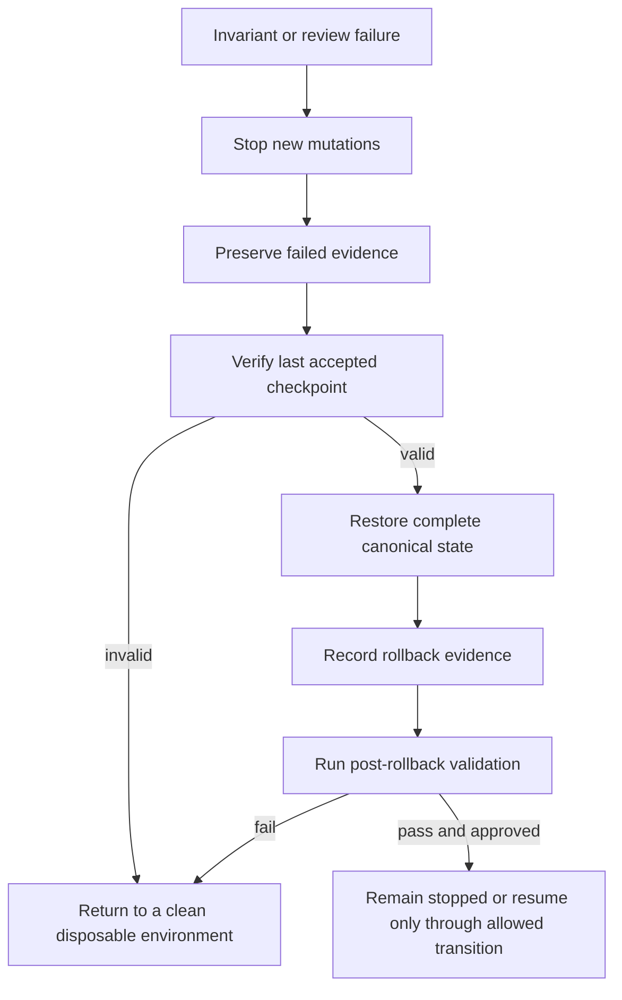

# Operations and recovery

## Operational boundary

The first eligible environment is a disposable local checkout or CI job with no credentials, no production data, no external writes, and no network-dependent runtime input. No persistent service, scheduler, remote worker, database, or production deployment is authorized.

Operations are evidence-producing verification activities, not continuous autonomous operation.

## Pre-run checklist

- [ ] Confirm the intended branch and exact 40-character SHA.
- [ ] Confirm the working tree is clean.
- [ ] Create a fresh virtual environment.
- [ ] Confirm no secrets or production credentials are present.
- [ ] Confirm runtime inputs are local, synthetic, bounded, and approved for review.
- [ ] Record configuration, schema, artifact, and fixture versions and hashes.
- [ ] Confirm the repository-wide policy validator passes at the exact head.
- [ ] Confirm open findings do not prohibit the planned verification step.
- [ ] Define the stop and rollback conditions before execution.

## Verification runbook

### 1. Record source identity

```bash
git status --short
git rev-parse HEAD
python --version
python -m pip --version
```

Write the outputs to an evidence directory rather than relying on terminal history.

### 2. Install in isolation

```bash
python -m venv .venv
. .venv/bin/activate
python -m pip install --upgrade pip setuptools wheel pytest
python -m pip install -e . --no-build-isolation
```

Do not reuse an environment containing unrelated packages when producing acceptance evidence.

### 3. Validate repository controls

```bash
python scripts/validate_consent_lock.py
python -m unittest discover -s tests -p 'test_consent_lock.py' -v
```

The exact command set may evolve, but a missing or failed repository-wide validator is a stop condition.

### 4. Compile and test

```bash
python -m compileall -q qso_runtime tests scripts
python -m pytest --junitxml=evidence/pytest.xml
```

For canonicalization, state, ledger, checkpoint, or rollback changes, run deterministic fixtures repeatedly and compare outputs.

### 5. Exercise local CLI health

Where the candidate CLI exists:

```bash
qso-run > evidence/qso-run.json
qso-run --version > evidence/qso-run-version.txt
qso-run --config config/instances.json > evidence/qso-config.json
```

Do not add `--genome-root` until local genome files are accepted and hash-fixed for the test being performed.

### 6. Build and hash artifacts

```bash
mkdir -p dist evidence
python -m pip wheel . --no-deps --no-build-isolation --wheel-dir dist
sha256sum dist/* > evidence/artifact-sha256.txt
```

For release review, also require sdist, clean-wheel installation, SBOM where applicable, provenance, and merged-head evidence.

### 7. Archive evidence

Include:

- exact source SHA;
- tool versions;
- commands and exit status;
- test reports;
- CLI output;
- configuration and fixture hashes;
- artifact hashes;
- open findings;
- cleanup and rollback result.

## Runtime health model

A candidate local runtime is healthy only when all applicable checks pass:

- source and configuration identity match the expected immutable values;
- schemas and hashes validate;
- startup and bounded shutdown succeed;
- rejected inputs leave state unchanged;
- event and attribution evidence verify;
- checkpoint state matches its digest;
- deterministic replay matches expected hashes;
- resource limits remain within bounds;
- no network, credential, external-write, generated-code execution, payment, or production activity occurs.

A test process being alive is not sufficient health evidence.

## Observability

Record structured, non-secret events for:

- source, configuration, schema, and artifact identity;
- lifecycle transitions;
- accepted and rejected input classes;
- message acceptance and rejection;
- resource-limit decisions;
- event and attribution ledger heads;
- checkpoint, freeze, interruption, recovery, and rollback decisions;
- deterministic replay comparisons;
- artifact creation and hashes;
- cleanup and post-validation.

Do not log raw confidential data, credentials, full sensitive documents, or unnecessary personal identifiers.

## Interruption procedure

When execution is interrupted:

1. Stop accepting new records and messages.
2. Preserve the exact process, source, input, and evidence state that can be captured safely.
3. Record the interruption reason and current lifecycle state.
4. Verify the current event and attribution ledger prefixes.
5. Verify the last checkpoint independently.
6. Enter the explicit interrupted state; do not silently continue as active.
7. Decide between validated recovery, rollback, or termination.

## Recovery procedure

Recovery is permitted only when:

- the source, configuration, identities, and schemas still match;
- the checkpoint and ledger evidence verify;
- resource limits permit safe restoration;
- the interruption reason is understood sufficiently for the bounded experiment;
- no external side effect occurred;
- the transition is allowed by the versioned lifecycle contract;
- review explicitly permits recovery.

A recovery run should reproduce the checkpoint hash before accepting new mutations.

## Rollback procedure

Rollback is required for any identity, schema, hash, type, atomicity, ledger, checkpoint, determinism, resource, security, privacy, or approval failure that invalidates continued operation.



Rollback must restore all mutable fields required for future behavior, including queues and counters where defined. It must not depend on ordinary event capacity being available unless capacity is reserved by contract.

## Incident response

### Classification triggers

Treat the event as an incident when any of the following occurs:

- untrusted content appears to influence instructions, permissions, or tools;
- a parser accepts ambiguous encoding, duplicate keys, wrong types, or malformed shape;
- a hash, path, source identity, or schema mismatch is observed;
- an operation leaves partial unledgered state;
- evidence validation fails;
- a workflow tests a different head than expected;
- a credential, network call, external write, or generated-code execution path appears;
- a repository-wide policy control fails or is weakened;
- an unexpected artifact or upstream dependency is consumed.

### Response

1. Stop the affected activity and block promotion.
2. Preserve raw evidence and exact source state.
3. Remove credentials from the environment without destroying forensic records.
4. Reproduce only in an isolated disposable environment.
5. Create a minimal negative fixture.
6. Repair the narrowest control.
7. Run the complete affected test and adversarial matrix.
8. Record findings, severity, disposition, and residual risk.
9. Reverify the exact repaired head and any eventual merged head.

## Cleanup

After a verification run:

- stop all local processes;
- delete disposable environments that are not part of retained evidence;
- preserve only approved reports and artifacts;
- confirm no external files or repositories were changed;
- confirm no credentials were persisted;
- record final ledger and checkpoint hashes;
- record cleanup completion and any residual files.

## Release stop conditions

Do not publish or deploy when any blocking gate is incomplete, including:

- unresolved correctness or security findings;
- stale or non-exact-head test evidence;
- unreconciled candidate branch;
- absent merged-head verification;
- unaccepted QSO-GENOMES or QSO-SEEKER contracts;
- missing source, sdist, wheel, checksums, provenance, or SBOM evidence;
- incomplete privacy, confidentiality, licensing, or attribution decisions;
- failed documentation strict build;
- untested rollback;
- missing explicit approval.

## No-op notification rule

Routine in-progress verification should not be reported as a milestone. Notify maintainers when a substantial documentation or acceptance milestone is complete, a blocker materially changes, or an architectural decision is required.
