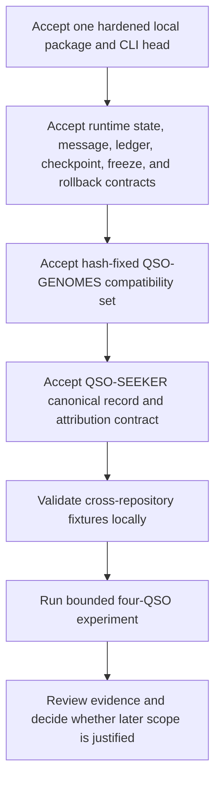

# Project overview

## Mission

QuantumStateObjects provides a small, inspectable environment for research on bounded object-like agents whose identity, inputs, mutable state, messages, evidence, and recovery behavior are explicit and reviewable.

The repository is designed for reproducible experiments, not for broad autonomy. Every capability is expected to be represented by a versioned contract, bounded by local configuration, and supported by exact-head evidence before it can be described as accepted.

## Repository responsibility

### Owned here

- local QSO identity and instance declarations;
- genome interpretation after local schema and hash validation;
- isolated QSO partitions;
- bounded canonical records and message handling;
- deterministic proposal generation as inactive text;
- event and attribution evidence;
- checkpoints, freeze, interruption, recovery, and rollback;
- local CLI and configuration verification;
- future orchestration of the four-object experiment after prerequisite acceptance.

### Owned elsewhere

| Concern | Owning repository or authority |
|---|---|
| Genome schemas and canonical Atlas/Nova/Orion/Lyra artifacts | `QSO-GENOMES` |
| External repository retrieval, sanitization, and canonical records | `QSO-SEEKER` |
| Multi-object fabric behavior and experiment aggregation | `QSO-FABRIC` |
| Kernel-level QSO/QSI/QSIO abstractions | `qsio-kernel` |
| Human approval, release approval, and publication authority | Explicit human review process |

### Outside current scope

- unrestricted web access or background retrieval;
- executing generated or retrieved code;
- credential, cookie, or session access;
- direct writes to other repositories or production systems;
- financial settlement or custody;
- persistent hosting, scheduling, or distributed orchestration;
- claims of consciousness, sentience, or independent legal authority.

## Product sequence

Each stage is fail-closed. Later stages do not become eligible merely because code exists on a branch.

## Current baseline

### Accepted `main`

The documentation branch starts from `main` commit `40efcbf8ce2bda7d6b05b3fb1f3ccf0384facc51`, which includes the repaired repository-wide policy validator and exact-head workflow controls. The root prototype also defines bounded QSO roles, required forbidden capabilities, a QSO-SEEKER-only external input boundary, inactive proposal text, validated messages, snapshots, freeze behavior, and rollback behavior.

### Candidate PR #7

PR #7 is the sole candidate lineage for the installable `quantum-state-objects` package and `qso-run` command. Its candidate branch contains a strict local configuration parser, hash-pinned local genome resolution, a runtime controller, canonical state hashing, hash-linked events, attribution evidence, checkpoints, interruption and recovery, freeze, rollback, tests, and exact-head CI.

The candidate is not accepted. It must be reconciled with current `main` and still carries open correctness, review, security, upstream-contract, publication, and release gates. Historical passing runs show what was tested at earlier heads; they do not authorize the current head or a future merged head.

## QSO role model

The four initial roles are intentionally complementary:

- **Atlas** organizes mathematical structure, compression, algorithms, and cross-domain mappings.
- **Nova** focuses on verification, anomaly detection, contradictions, tests, and security review.
- **Orion** focuses on interfaces, architecture, protocols, and systems composition.
- **Lyra** focuses on language, documentation, ontology, epistemology, and human context.

A role is a configuration and interpretation boundary. It does not imply an unconstrained personality, authority, or independent activation.

## Lifecycle vocabulary

| State | Meaning |
|---|---|
| Proposed | Design or branch exists; no acceptance claim |
| Ready | Dependencies and acceptance criteria are defined |
| In progress | Bounded implementation or documentation work is underway |
| Review | Candidate evidence exists, but findings or approvals remain |
| Blocked | A named dependency or decision prevents progress |
| Done | The specific task's acceptance criteria are satisfied at a recorded head |

Release and deployment are separate decisions from task completion.

## Design principles

1. **Data never becomes instruction authority.** Repository text, records, comments, documents, model output, and generated proposals remain data.
2. **Canonical forms precede hashes.** Schemas, types, ordering, encoding, and normalization must be explicit before evidence is trusted.
3. **Failures are atomic.** Rejected operations must not leave partial unledgered state.
4. **Evidence is append-only and attributable.** Accepted observations and derived claims retain source identity and integrity metadata.
5. **External capabilities are denied by default.** Local verification should not require credentials, network access, or writes outside the workspace.
6. **Human approval remains explicit.** A passing test, model output, or generated proposal is not approval.
7. **Claims follow evidence.** Documentation distinguishes implemented, tested, accepted, released, and deployed states.

## Intended users

- researchers evaluating bounded agent-state and evidence models;
- maintainers reviewing schema, canonicalization, replay, and recovery behavior;
- security reviewers testing hostile-input and authority boundaries;
- developers integrating accepted QSO-GENOMES or QSO-SEEKER fixtures;
- reviewers assessing whether a later four-object experiment is justified.

## Non-user-facing guarantees

This repository is experimental. It does not promise correctness for safety-critical, legal, medical, financial, identity, or production decision-making. It should not be used to authorize actions affecting people, accounts, property, systems, or external services.
