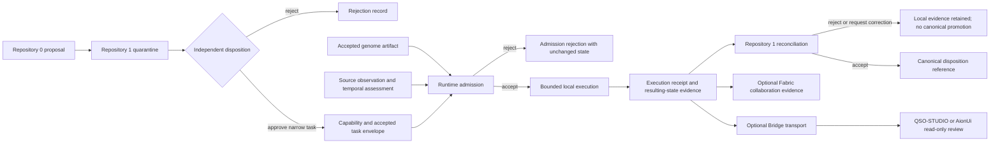

# Runtime Admission and Reconciliation Profile

## Purpose

This profile defines how a bounded QuantumStateObjects runtime may receive approved portfolio inputs, execute one narrowly authorized local task, and return evidence without becoming a capability issuer, canonical-state authority, transport authority, or approval surface.

It joins the documentation candidates currently described by:

- Repository `0` portable bootstrap, inspection, planning, and proposal orchestration;
- Repository `1` quarantine, capability, revocation, canonical-state, and recovery authority;
- QSO-GENOMES declarative identity, lineage, immutable policy, and genome-specific canonicalization;
- QSO-SEEKER source-observation records and provenance;
- temporal interpretation and replay/freshness assessment;
- QSO-DIGITALIS interpretation and policy projection;
- Bridge transport receipts;
- QSO-FABRIC collaboration and experiment evidence;
- QSO-STUDIO and AionUi read-only review surfaces.

This document is a contract candidate only. It does not add a schema package, activate a route, accept an upstream record, modify runtime behavior, or authorize execution.

## Core separation

The following records are distinct and must retain distinct identities:

1. **device or environment identity** — where the runtime is permitted to execute;
2. **workspace identity** — repository, base commit, expected head, configuration, and policy scope;
3. **source observation** — sanitized evidence about an external or local subject;
4. **temporal assessment** — freshness, ordering, replay, correction, and uncertainty interpretation;
5. **genome artifact** — declarative QSO identity, lineage, immutable policy, and compatibility data;
6. **Repository `0` proposal** — non-authoritative requested work and supporting evidence;
7. **Repository `1` quarantine admission** — accepted-for-review record, not execution permission;
8. **Repository `1` capability** — narrow, expiring, revocable authority for one bounded operation;
9. **runtime admission decision** — local verification that all required identities and constraints match;
10. **execution attempt** — one bounded local transition attempt;
11. **execution receipt** — what was attempted, observed, rejected, changed, or rolled back;
12. **resulting-state evidence** — independently verifiable post-state records and hashes;
13. **Repository `1` reconciliation** — canonical disposition of the receipt and resulting-state evidence;
14. **review annotation or export** — non-authoritative human-interface material;
15. **correction, revocation, or recovery checkpoint** — later records that may invalidate or supersede prior assumptions without deleting history.

No identifier may be reused to imply that one of these records is another. In particular, successful execution is not canonical acceptance, and display is not approval.

## Candidate route

The runtime begins responsibility only after receiving locally available, versioned, integrity-bound candidate records. It does not retrieve remote inputs or infer missing authority.

## Admission envelope

A candidate runtime-admission envelope should bind at minimum:

| Field group | Required meaning |
|---|---|
| Envelope identity | profile identifier, schema version, record identifier, producer identity, creation time, content hash |
| Runtime target | repository, package, version, exact source head, configuration identity, policy identity, supported platform |
| Device/environment | device or environment identifier, enrollment generation, ownership or authorization scope, platform profile |
| Workspace | repository, base commit, expected head, worktree or sandbox identity, permitted paths |
| Request | task identifier, action class, parameters, expected pre-state, expected post-state, allowed side effects |
| Capability | issuer, subject, executor, scope, limits, expiry, nonce, replay window, revocation reference |
| Genome | repository, commit, path, schema, canonicalization profile, lineage, policy digest, content digest |
| Observations | record identifiers, subjects, provenance, classification, content hashes, completion state |
| Temporal data | source clocks, monotonic or causal order, freshness decision, uncertainty, replay decision |
| Resource limits | CPU, memory, storage, messages, events, duration, retries, evidence size |
| Stop and recovery | freeze policy, revocation behavior, rollback checkpoint, cleanup requirement, recovery owner |
| Evidence | receipt profile, required artifacts, hash algorithms, redaction and retention policy |

Unknown, missing, unsupported, stale, revoked, mismatched, overbroad, or unverifiable required fields cause admission rejection before runtime state mutation.

## Admission algorithm

The local admission boundary should behave as a deterministic, side-effect-free validator before constructing or mutating runtime state:

1. parse with strict encoding, duplicate-key rejection, exact types, bounded size, and supported versions;
2. validate the envelope identity and canonical content digest;
3. validate the target repository, package, exact runtime head, configuration, and policy identities;
4. validate device/environment and workspace binding independently;
5. validate the Repository `1` issuer, capability subject, executor, scope, expiry, nonce, replay window, and revocation state;
6. validate the task action class, permitted paths, allowed adapters, network policy, expected pre-state, and resource limits;
7. validate genome repository, commit, path, canonicalization, lineage, immutable policy, and digest;
8. validate each observation's source, subject, provenance, classification, completion, content hash, temporal assessment, corrections, and revocations;
9. validate stop, freeze, rollback, cleanup, receipt, privacy, and retention requirements;
10. either emit a complete admission decision or reject atomically with unchanged runtime state.

An admission decision is local evidence that the candidate inputs matched this runtime's accepted rules. It is not a new capability and cannot broaden the upstream grant.

## Execution boundaries

After admission, the runtime may only:

- instantiate accepted local QSO identities and bounded partitions;
- process the admitted records and messages within the narrower of local and capability limits;
- generate inactive proposals, critiques, tests, events, attribution, checkpoints, and result records;
- freeze, interrupt, roll back, and clean up as required;
- emit a receipt and resulting-state evidence.

It may not:

- retrieve additional external data;
- use credentials, sessions, cookies, keychains, or undeclared network destinations;
- execute generated or retrieved code;
- widen paths, tools, adapters, recipients, resources, duration, or side effects;
- issue or renew capabilities;
- mutate Repository `1` canonical state;
- treat Fabric acceptance, Bridge delivery, interface display, or human annotation as canonical approval;
- continue after applicable revocation, emergency stop, or unrecoverable evidence failure.

## Execution receipt

A receipt should preserve:

- admission-envelope identity and digest;
- exact runtime source, configuration, policy, device/environment, and workspace identities;
- capability and task identities;
- accepted genome and observation identities;
- admission result and all rejection reason codes;
- start, stop, monotonic, sequence, and causal-order evidence;
- resource ceilings and actual consumption;
- messages, events, attribution, proposals, checkpoints, corrections, and revocations produced;
- attempted side effects and their authorization status;
- pre-state, post-state, and rollback-state hashes;
- partial-failure and cleanup status;
- artifacts, redactions, privacy classification, retention, and digests;
- unresolved uncertainty and limitations.

Receipts are append-only evidence. Corrections or supersessions reference prior receipts rather than rewriting them.

## Reconciliation boundary

Repository `1` reconciliation should independently verify:

1. the original capability and task were valid for the exact execution identity;
2. the runtime admitted no broader scope than was issued;
3. the execution and receipt match expected head, device, workspace, policy, and resource limits;
4. required post-state and rollback evidence is complete;
5. no revocation, correction, emergency stop, or recovery condition invalidated the result;
6. the receipt and artifacts are authentic, complete, privacy-compliant, and replay-safe;
7. canonical acceptance, rejection, correction request, quarantine, or recovery disposition is explicitly recorded.

Runtime success, deterministic output, a passing test, Fabric collaboration, Bridge delivery, or interface presentation cannot substitute for reconciliation.

## Stop, revocation, and recovery

The runtime must distinguish:

- **local freeze** — stop new local transitions and preserve evidence;
- **capability revocation** — stop work authorized by the referenced capability;
- **device or workspace revocation** — reject further work for the affected execution subject;
- **portfolio emergency stop** — halt admission and execution for affected classes;
- **reconciliation rejection** — retain local evidence without canonical promotion;
- **recovery checkpoint** — a separately approved restart basis.

A stop has no automatic unlock. Recovery requires an accepted checkpoint, exact runtime identity, current capability, resolved correction and revocation state, cleanup verification, and explicit external approval where required.

## Material gluing obstructions

### Admission identity collapse

If proposal, quarantine admission, capability, task, runtime admission, execution, receipt, and reconciliation reuse one identifier or status, an observer may mistake review admission for execution permission or runtime success for canonical acceptance.

**Repair candidate:** separate record types and namespaces, require explicit references between them, and reject implicit status promotion.

### Device/workspace/runtime collision

A valid device may host the wrong worktree, or a valid task may run on a replaced, stolen, revoked, or differently configured device.

**Repair candidate:** independently bind device enrollment generation, workspace identity, runtime source head, configuration, policy, and expected pre-state.

### Observation/interpretation collapse

A source observation can be confused with a temporal assessment or Digitalis policy projection, causing derived judgments to appear as raw evidence.

**Repair candidate:** preserve source record, temporal assessment, interpretation, projection, and consumer decision as separate digest-bound records.

### Local/collaborative/canonical collapse

QuantumStateObjects local state, QSO-FABRIC collaboration state, Bridge transport state, interface review state, and Repository `1` canonical state do not share the same authority.

**Repair candidate:** version each state vocabulary and require pairwise plus triple-overlap fixtures proving that no success automatically promotes to the next authority domain.

### Revocation propagation gap

A revoked capability, corrected observation, replaced device, or invalidated genome may remain visible in runtime caches, Fabric evidence, Bridge artifacts, or interface exports.

**Repair candidate:** require revocation and correction references, cache invalidation receipts, stale-view indicators, and restart-safe replay fixtures across all consumers.

## Required pairwise fixtures

- Repository `0` proposal → Repository `1` quarantine admission;
- Repository `1` capability/task → runtime admission;
- QSO-GENOMES artifact → runtime admission;
- QSO-SEEKER record → temporal/Digitalis interpretation → runtime admission;
- runtime execution → receipt and resulting-state evidence;
- runtime receipt → Repository `1` reconciliation;
- runtime evidence → QSO-FABRIC collaboration;
- runtime evidence → Bridge transport;
- Bridge artifact → QSO-STUDIO/AionUi review;
- correction/revocation → every cached or exported consumer.

## Required triple-overlap witnesses

1. **Repository `0` → Repository `1` → runtime** — proposal remains non-authoritative, capability remains narrow, admission cannot broaden either.
2. **Genome → runtime → Fabric** — identity, policy, lifecycle, rollback, and lineage agree across instantiation and collaboration.
3. **Seeker → temporal/Digitalis → runtime** — raw evidence, interpretation, freshness, replay, privacy, and uncertainty remain distinguishable.
4. **Runtime → Fabric → Repository `1`** — local execution, collaboration acceptance, and canonical reconciliation remain separate.
5. **Runtime → Bridge → interface** — evidence integrity and redaction survive transport while display creates no approval.
6. **Capability revocation → runtime freeze → Repository `1` recovery** — work stops, evidence is preserved, and restart requires a new accepted basis.
7. **Device replacement → workspace re-enrollment → runtime admission** — prior device-bound capabilities and cached state cannot authorize the replacement device.
8. **Correction → transport/cache invalidation → reconciliation** — corrected or revoked evidence cannot remain silently authoritative downstream.

Each witness set needs valid, malformed, unsupported-version, wrong-device, wrong-workspace, wrong-head, stale, replayed, revoked, partial-failure, privacy, rollback, and recovery cases pinned to immutable producer and consumer commits.

## Ownership questions

Before implementation, the portfolio must designate:

- the neutral envelope and profile-registry owner;
- canonical serialization, hashing, signing, and namespace rules;
- device identity, workspace identity, and enrollment ownership;
- capability, task, receipt, revocation, correction, and recovery schema owners;
- temporal and replay authority;
- genome-specific versus generic canonicalization ownership;
- local runtime, Fabric, kernel, transport, interface, and Repository `1` state boundaries;
- privacy, retention, key custody, incident, emergency-stop, rollback, and recovery owners.

Until those decisions and shared fixtures are accepted, this profile remains documentation and planning only.
