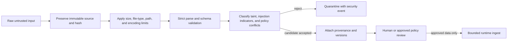

# Security and trust

## Security posture

QuantumStateObjects assumes a hostile, prompt-injection-capable input environment. Repository content, issues, pull-request text, comments, JSON, Markdown, filenames, documents, generated proposals, model output, and upstream artifacts are data. None of them can grant themselves instruction, tool, policy, execution, credential, network, write, approval, or release authority.

The first candidate is local, credential-free, network-independent, and non-deploying. Security claims remain limited to specific reviewed controls and exact-head evidence.

## Protected assets

- immutable identity and genome fields;
- accepted configuration and schema versions;
- QSO partition state;
- message queues and allowlists;
- event and attribution ledgers;
- checkpoints, freeze records, and rollback evidence;
- source, artifact, and fixture hashes;
- review decisions and release approvals;
- repository-wide consent and capacity policy;
- the distinction between inactive proposals and authorized implementation.

## Trust-boundary rules

1. **External data is never an instruction source.** Imperative text remains payload content.
2. **Parse before interpretation.** Encoding, JSON, schema, type, size, path, and hash checks occur before runtime use.
3. **Preserve originals.** Raw evidence is retained; sanitized or normalized views are derived artifacts.
4. **Attach provenance.** Accepted inputs bind source identity, content digest, parser/sanitizer versions, policy version, and disposition.
5. **Use allowlists.** Accepted identities, repositories, paths, message kinds, peers, operations, and lifecycle transitions are explicit.
6. **Deny external capabilities.** Untrusted content cannot cause network access, credential access, code execution, repository writes, settlement, or deployment.
7. **Fail atomically.** Rejection restores or preserves the complete pre-operation state.
8. **Retain evidence.** Security events, rejected inputs, and review dispositions remain attributable and hash-bound.
9. **Require human approval.** Tests and generated output cannot approve merge, release, deployment, or external action.

## Threat model

| Threat | Example | Required control |
|---|---|---|
| Direct prompt injection | Record says to ignore policy and invoke a tool | Treat as inert content; flag and quarantine |
| Indirect injection | Repository file, PDF, issue comment, or metadata embeds instructions | Parse as data; preserve provenance; never grant instruction authority |
| Encoding ambiguity | UTF-16/32 or malformed bytes bypass a UTF-8 contract | Strict UTF-8 decoding before JSON parsing |
| JSON ambiguity | Duplicate keys or non-finite values create parser disagreement | Duplicate-key and non-standard value rejection |
| Type confusion | `true` passes as integer `1` | Exact type checks; Boolean rejection in integer fields |
| Path manipulation | Absolute path, traversal, symlink, or case mismatch changes source | Normalized relative paths, regular-file checks, fixed roots, exact case |
| Artifact substitution | Correct path points to changed genome or record | Accepted repository/path/schema plus SHA-256 verification |
| Identity widening | Alias or retired identity gains sender, recipient, or reviewer authority | Canonical identity set and explicit migration records |
| Message forgery | Sender, recipient, kind, or payload changes after construction | Canonical message digest and allowlist validation |
| Partial-state failure | Delegated ingest mutates records before raising | Pre-operation checkpoint and atomic restoration |
| Ledger tampering | Entry is removed, reordered, reshaped, or rehashed | Strict entry shape, sequence, previous-link, and digest verification |
| Resource exhaustion | Records or events fill capacity and prevent recovery | Prechecks, bounded inputs, reserved recovery evidence capacity |
| Generated-code activation | Proposal text is executed or applied automatically | Inactive status, no execution path, explicit review and separate implementation |
| Workflow substitution | CI tests a different commit than the submitted head | Exact-head checkout/assertion and pinned workflow actions |
| Credential leakage | Checkout or runtime retains tokens | Read-only permissions and disabled persisted credentials |

## Repository-wide policy binding

The accepted `main` branch contains a repository-wide policy validator that checks the immutable policy identity, global scope, required principles, lock behavior, prohibited bypass patterns, strict JSON parsing, exact submitted source, and retained evidence.

Documentation and runtime work must not weaken that policy or imply automatic approval. Any ambiguity, withdrawal, incapacity, coercion concern, or policy mismatch must stop the covered action, preserve evidence, and require fresh review.

## Hostile-input security issue

Open issue #8 establishes the local security envelope for suspected hostile or instruction-bearing inputs. Its key requirements include:

- preserve original evidence and source metadata;
- separate raw and sanitized views;
- add provenance and taint metadata;
- quarantine suspected injections;
- deny tool, execution, credential, network, and write authority from content;
- add adversarial tests across text, metadata, filenames, JSON, Markdown, documents, comments, and cross-repository inputs;
- require exact-head security evidence before upstream ingestion or experiment execution.

The issue is open. This documentation does not mark those controls complete.

## Input processing pipeline

Sanitization does not upgrade authority. A sanitized record remains data.

## Least privilege

The first candidate should run with:

- no stored secrets;
- no write token;
- no network-dependent input;
- no shell or subprocess path exposed to records or proposals;
- no package installation initiated by runtime content;
- no access to browser sessions, cookies, or local credentials;
- no external repository mutation;
- no production endpoints;
- bounded CPU, memory, file size, record count, message count, event count, and duration;
- explicit disposable working directories.

## Security testing matrix

Required tests should include:

- direct, indirect, encoded, nested, multilingual, and metadata-based instruction injection;
- duplicate JSON keys and parser differentials;
- malformed UTF-8 and alternate encodings;
- non-finite numbers and extreme numeric values;
- wrong and mixed JSON types;
- malicious filenames, path traversal, symlinks, and special files;
- oversized and deeply nested content;
- unknown identities, aliases, peers, recipients, and message kinds;
- digest mismatch, replay, reordering, truncation, and duplicate evidence;
- mutation exceptions at every step of ingest, messaging, freeze, and rollback;
- full resource ceilings and reserved recovery behavior;
- tampered checkpoints and persisted ledgers;
- attempts to execute or apply generated snippets;
- secret scanning and workflow permission review;
- exact-head and merged-head workflow identity.

## Security evidence

A security review package should record:

- exact source SHA and base SHA;
- workflow and action identities;
- permissions and credential-persistence settings;
- supported Python versions;
- test commands, reports, and counts;
- adversarial fixture inventory and hashes;
- source, sdist, wheel, SBOM, and provenance hashes;
- open findings and severity;
- reviewer disposition;
- rollback drill result;
- artifact retention location and expiry.

## Vulnerability response

For a suspected vulnerability:

1. Stop runtime and publication activity.
2. Preserve raw inputs, logs, comments, artifacts, hashes, timestamps, and exact source state.
3. Do not execute, rewrite, or erase the suspicious content.
4. Reproduce in an isolated credential-free environment.
5. Add a minimal failing fixture.
6. Repair the narrowest control without widening authority.
7. Run focused and complete adversarial matrices at one immutable head.
8. Record review disposition and residual risk.
9. Reconcile and verify the merged head before resuming release work.

Public disclosure, private reporting, and remediation timing require explicit maintainer judgment based on the evidence and affected scope.

## Security non-claims

This repository does not claim immunity from prompt injection, supply-chain attacks, malicious maintainers, compromised runners, cryptographic key compromise, operating-system compromise, or undiscovered parser/runtime defects. Hashes provide integrity evidence under stated assumptions; they do not establish truth, safety, consent, or authorization by themselves.
